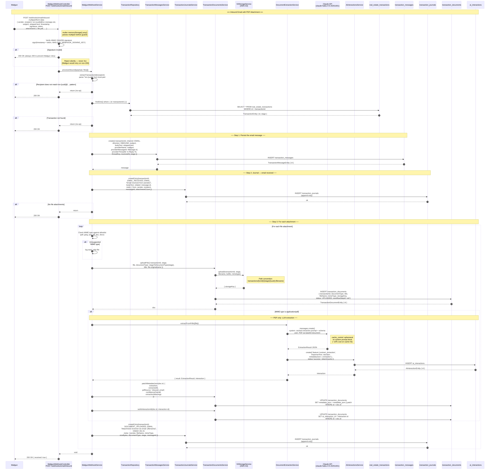
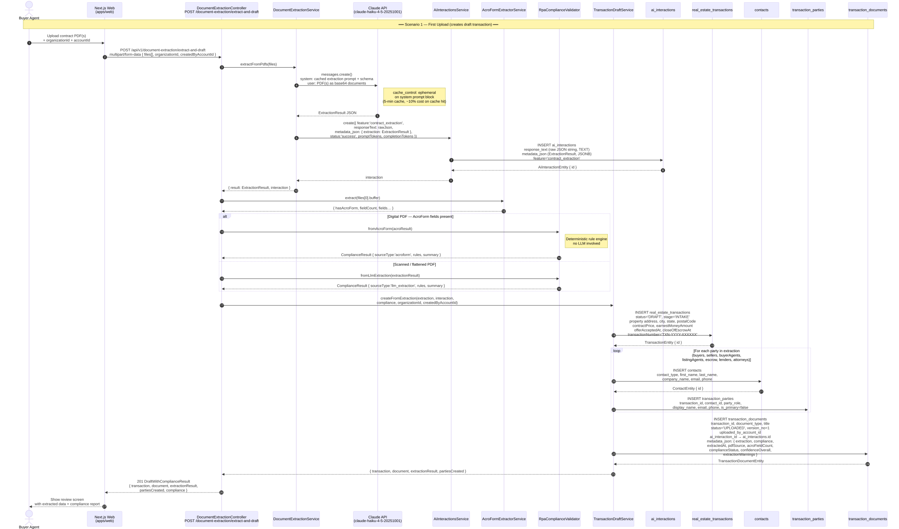
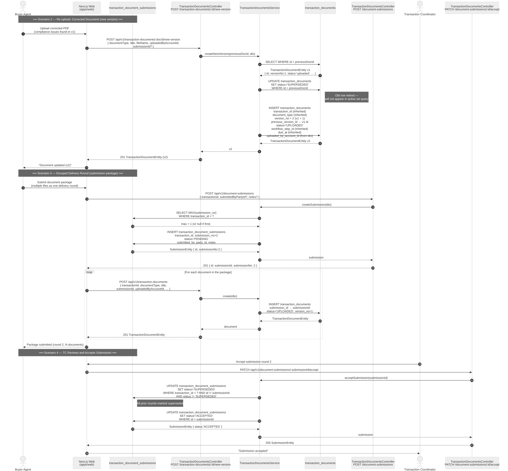

# TC — Product Design & Architecture

Real estate transaction coordination platform. This document covers functional requirements, non-functional requirements, architecture decisions, and detailed design for each subsystem.

---

## Table of Contents

1. [Product Overview](#1-product-overview)
2. [Functional Requirements](#2-functional-requirements)
    - 2.1 [Account & Identity](#21-account--identity)
    - 2.2 [Transactions](#22-transactions)
    - 2.3 [Parties](#23-parties)
    - 2.4 [Documents & Forms](#24-documents--forms)
    - 2.5 [Tasks](#25-tasks)
    - 2.6 [Messages](#26-messages)
    - 2.7 [Journal](#27-journal)
    - 2.8 [Events & Milestones](#28-events--milestones)
    - 2.9 [Organizations](#29-organizations)
    - 2.10 [Contacts](#210-contacts)
    - 2.11 [Transaction Access Management](#211-transaction-access-management)
3. [Non-Functional Requirements](#3-non-functional-requirements)
    - 3.1 [Security](#31-security)
    - 3.2 [Data Integrity](#32-data-integrity)
    - 3.3 [Reliability](#33-reliability)
    - 3.4 [Scalability](#34-scalability)
    - 3.5 [Observability](#35-observability)
    - 3.6 [Extensibility](#36-extensibility)
4. [Architecture Overview](#4-architecture-overview)
    - 4.1 [Stack](#41-stack)
    - 4.2 [Monorepo layout](#42-monorepo-layout)
    - 4.3 [API design](#43-api-design)
    - 4.4 [Architecture decisions](#44-architecture-decisions)
5. [Domain Model](#5-domain-model)
    - 5.1 [ER Diagram](#51-er-diagram)
    - 5.2 [Entity relationships (text summary)](#52-entity-relationships-text-summary)
    - 5.3 [The 15 domain modules](#53-the-15-domain-modules)
6. [Transaction Lifecycle](#6-transaction-lifecycle)
    - 6.1 [Stages (ordered)](#61-stages-ordered)
    - 6.2 [Linear stage model](#62-linear-stage-model)
    - 6.3 [How the six tracking tables work together](#63-how-the-six-tracking-tables-work-together)
    - 6.4 [AI pipeline design (pending)](#64-ai-pipeline-design-pending)
7. [Forms & Document Model](#7-forms--document-model)
    - 7.1 [Three systems](#71-three-systems)
    - 7.2 [Submission rounds](#72-submission-rounds)
    - 7.3 [Document status lifecycle](#73-document-status-lifecycle)
    - 7.4 [Document versioning](#74-document-versioning)
    - 7.5 [TC-less transactions](#75-tc-less-transactions)
    - 7.6 [CAR form categories (14)](#76-car-form-categories-14)
    - 7.7 [Form requirement rules](#77-form-requirement-rules)
    - 7.8 [Pre-built form packages (7)](#78-pre-built-form-packages-7)
    - 7.9 [Key files](#79-key-files)
    - 7.10 [S3 file storage](#710-s3-file-storage)
8. [Authentication & Authorization](#8-authentication--authorization)
    - 8.1 [Registration flow](#81-registration-flow)
    - 8.2 [Login flow](#82-login-flow)
    - 8.3 [Session management (web)](#83-session-management-web)
    - 8.4 [Pending](#84-pending)
    - 8.5 [New endpoints added](#85-new-endpoints-added)
9. [Email Integration](#9-email-integration)
    - 9.1 [Outbound — Mailgun](#91-outbound--mailgun)
    - 9.2 [Inbound — webhook routing](#92-inbound--webhook-routing)
    - 9.3 [Future: LLM email interpretation](#93-future-llm-email-interpretation)
    - 9.4 [Email template system](#94-email-template-system)
10. [PDF Processing & Compliance](#10-pdf-processing--compliance)
    - 10.1 [Two extraction paths](#101-two-extraction-paths)
    - 10.2 [LLM provider abstraction](#102-llm-provider-abstraction)
    - 10.3 [RPA compliance validation](#103-rpa-compliance-validation)
    - 10.4 [Sequence diagrams](#104-sequence-diagrams)
    - 10.5 [Data persistence](#105-data-persistence)
    - 10.6 [Endpoints](#106-endpoints)
    - 10.7 [Draft session](#107-draft-session)
    - 10.8 [Disclosure PDF extraction (via inbound email)](#108-disclosure-pdf-extraction-via-inbound-email)
    - 10.9 [Future: AWS Textract](#109-future-aws-textract)
    - 10.10 [Contract review wizard](#1010-contract-review-wizard)
    - 10.11 [`@tc/document-intelligence` package — architecture](#1011-tcdocument-intelligence-package--architecture)
        - [Five-layer pipeline](#five-layer-pipeline)
        - [TransactionContext — cross-stage fact carry-forward](#transactioncontext--cross-stage-fact-carry-forward)
        - [upcomingDeadlines — date tracking for reminders](#upcomingdeadlines--date-tracking-for-reminders)
        - [Package structure](#package-structure)
        - [Scenario testing — temporal scenarios](#scenario-testing--temporal-scenarios-counter-offers-late-uploads)
        - [NestJS adapter layer](#nestjs-adapter-layer-application-developers-own-this)
11. [UI Design Patterns](#11-ui-design-patterns)
    - 11.1 [Stack](#111-stack)
    - 11.2 [Layout patterns](#112-layout-patterns)
    - 11.3 [Transaction Management page](#113-transaction-management-page-dashboardtransaction-management)
    - 11.4 [Transaction detail page — stage tab structure](#114-transaction-detail-page--stage-tab-structure)
    - 11.5 [Notification Status sub-tab (swimlane)](#115-notification-status-sub-tab-swimlane)
    - 11.6 [Documents sub-tab](#116-documents-sub-tab)
    - 11.7 [Stage info sub-tabs — detail views](#117-stage-info-sub-tabs--detail-views)
    - 11.8 [Contacts page](#118-contacts-page-dashboardcontacts)
    - 11.9 [Swimlane diagram (legacy reference)](#119-swimlane-diagram-legacy-reference)
12. [Transaction Access Control](#12-transaction-access-control)
    - 12.1 [Problem statement](#121-problem-statement)
    - 12.2 [Four access modes](#122-four-access-modes)
    - 12.3 [Access scope on organization memberships](#123-access-scope-on-organization-memberships)
    - 12.4 [Transaction access grants](#124-transaction-access-grants)
    - 12.5 [Access resolution algorithm](#125-access-resolution-algorithm)
    - 12.6 [New entities and migrations](#126-new-entities-and-migrations)
13. [Transaction Events & Milestones](#13-transaction-events--milestones)
    - 13.1 [Overview](#131-overview)
    - 13.2 [Event types](#132-event-types)
    - 13.3 [Automatic seeding on contract submit](#133-automatic-seeding-on-contract-submit)
    - 13.4 [Buyer vs. seller stage visibility](#134-buyer-vs-seller-stage-visibility)
    - 13.5 [Event status lifecycle](#135-event-status-lifecycle)
14. [Deadline Reminder System](#14-deadline-reminder-system)
    - 14.1 [Design principle](#141-design-principle)
    - 14.2 [`transaction_event_reminders` table (planned)](#142-transaction_event_reminders-table-planned)
    - 14.3 [Reminder scheduling flow (current implementation)](#143-reminder-scheduling-flow-current-implementation)
    - 14.4 [Reminder processor flow (current implementation)](#144-reminder-processor-flow-current-implementation)
    - 14.5 [Who receives reminders](#145-who-receives-reminders)
    - 14.6 [Reminder schedule](#146-reminder-schedule)
    - 14.7 [Email templates](#147-email-templates)
    - 14.8 [Cancellation cutoff](#148-cancellation-cutoff)
    - 14.9 [Queue configuration](#149-queue-configuration)
    - 14.10 [Key files](#1410-key-files)
    - 14.11 [Upstash Redis — current vs. future](#1411-upstash-redis--current-vs-future)
15. [Transaction Clock Settings](#15-transaction-clock-settings)
    - 15.1 [Purpose](#151-purpose)
    - 15.2 [DB table — `transaction_clock_settings`](#152-db-table--transaction_clock_settings)
    - 15.3 [Timezone assignment](#153-timezone-assignment)
    - 15.4 [Virtual clock](#154-virtual-clock)
    - 15.5 [API](#155-api)
    - 15.6 [UI — ClockPanel](#156-ui--clockpanel)
    - 15.7 [Testing workflow](#157-testing-workflow)
16. [Backlog](#16-backlog)
    - 16.1 [Core wiring](#161-core-wiring)
    - 16.2 [Deadline reminders](#162-deadline-reminders)
    - 16.3 [AI pipeline](#163-ai-pipeline)
    - 16.4 [Infrastructure](#164-infrastructure)
    - 16.5 [Seller flow](#165-seller-flow)
    - 16.6 [Form templates — out-of-box system templates](#166-form-templates--out-of-box-system-templates)
    - 16.7 [Swimlane — unified communications view](#167-swimlane--unified-communications-view)
    - 16.8 [Document intelligence — UNKNOWN form identification](#168-document-intelligence--unknown-form-identification)
17. [Web App Sitemap](#17-web-app-sitemap)
    - 17.1 [Route map](#171-route-map)
    - 17.2 [Client-component API calls](#172-client-component-api-calls)
    - 17.3 [API prefix & auth](#173-api-prefix--auth)

---

## 1. Product Overview

TC is a transaction coordination (TC) platform for California real estate professionals. It centralizes the paperwork, communication, and task management that a transaction coordinator handles from accepted offer through closing.

**Primary users:**
- Transaction coordinators (TCs) — manage multiple transactions simultaneously
- Listing and buyer agents — submit transactions, track progress
- Broker admins — oversight across their team's transactions

**Core value proposition:** Replace email chains, spreadsheets, and disconnected e-sign portals with a single workflow that tracks every document, message, task, and milestone from contract to close.

---

## 2. Functional Requirements

### 2.1 Account & Identity

- Users register with email + password; email verification required before first login
- Each user has one Account (profile) with display name, phone, address, organization
- Passwords: minimum 8 characters; bcrypt hashed
- Email verification link expires in 24 hours
- User statuses: `pending` (unverified) → `active` → `suspended`

### 2.2 Transactions

- Create a transaction with property address, transaction type, and involved parties
- Transaction types: residential, income property, commercial, land, manufactured home, new construction
- Track transaction through 9 ordered stages (see §6)
- Each transaction has a dedicated inbound email address (`txn-{uuid}@txn.mytcapp.net`) for routing provider emails into the thread
- Dashboard shows active / pending / closed / total counts with transaction list

### 2.3 Parties

- Each transaction has multiple parties with defined roles: buyer, seller, buyer agent, seller agent, listing agent, transaction coordinator, lender, escrow officer, title officer, inspector, appraiser, HOA contact, attorney, other
- Up to 14 named roles per transaction
- Parties link to Contacts (buyers/sellers) or Accounts (agents/TCs within the platform)

### 2.4 Documents & Forms

- Attach documents to a transaction with status tracking: requested → uploaded → under_review → signed → approved → rejected / expired
- Support California CAR forms: 78 named forms across 14 categories
- Form packages auto-select required forms based on transaction type, side (buyer/seller/dual/listing), and state
- Forms are flagged required, optional, or conditional (with reason)
- Documents can be scoped to a specific workflow step / phase
- PDF upload triggers extraction and compliance check (see §10)

### 2.5 Tasks

- Checklist of tasks per transaction; tasks can depend on other tasks (`dependsOnTaskId`)
- Task statuses: open, in_progress, completed, blocked, cancelled
- Tasks can be assigned to a party or account

### 2.6 Messages

- Inbound and outbound email per transaction stored in `transaction_messages`
- Channel: email or SMS; direction: inbound or outbound
- Reply chains resolved via `providerThreadId` → `providerMessageId`
- Unresponded thread detection: last message in a thread with no reply is flagged
- Future: LLM interpretation of inbound emails to extract action items

### 2.7 Journal

- Append-only audit log (`transaction_journals`) — every significant event written here
- Journal types: email_received, document_uploaded, status_changed, task_completed, etc.
- No update or delete ever — immutable record of what happened and when

### 2.8 Events & Milestones

- Calendar events and milestones attached to a transaction (inspection dates, closing date, contingency deadlines)
- Event types: `offer_accepted`, `open_escrow`, `disclosures_due`, `inspection`, `appraisal`, `loan_commitment`, `closing`, `possession`, `final_walkthrough`, `contingency_deadline`, `post_close_followup`
- Dates are automatically seeded from the PDF contract extraction result when a contract is submitted (see §13)
- Each event generates up to three deadline reminder emails (7 days, 3 days, day-of) via the Bull queue (see §14)

### 2.9 Organizations

- Brokerages, title companies, and other organizations can be modeled
- Users can be members of one or more organizations with a role within that org

### 2.10 Contacts

- Buyers, sellers, and other third parties who are not platform users
- Linked to transaction parties

### 2.11 Transaction Access Management

- Administrators can grant explicit per-transaction access to any platform account (e.g., independent contractor TC)
- Access grants specify access level: `read`, `collaborate`, or `manage`
- Grants can have an optional expiry date; they can be revoked at any time
- Access is determined by four additive modes — see §12 for the full model
- Transaction Management UI page provides a form to create/revoke grants and tables showing current agents, coordinators, and active grants

---

## 3. Non-Functional Requirements

### 3.1 Security

- All API endpoints protected by JWT (except `/auth/register`, `/auth/login`, `/auth/verify-email`)
- Inbound webhook authenticated by HMAC-SHA256 signature + timestamp replay protection (15-minute window)
- Sensitive fields never returned in API responses: `passwordHash`, `storageKey`, `promptText`, `toolCallsJson`, `bodyHtml`, `preferencesJson`
- Passwords bcrypt-hashed; never stored in plaintext
- httpOnly cookies for web session tokens (no localStorage)
- CORS locked to known origins per environment

### 3.2 Data Integrity

- No `synchronize: true` in TypeORM — all schema changes via migration files
- Append-only tables (`transaction_journals`, `ai_interactions`) have no update/delete paths at any layer
- Enums stored as `varchar` in DB for forward compatibility without migrations on enum expansion

### 3.3 Reliability

- Inbound webhook always returns HTTP 200 to prevent provider retries; errors are caught, logged, and not re-thrown
- Email sending failures surface as errors (not silently swallowed) so callers can handle retry logic

### 3.4 Scalability

- API stateless; horizontally scalable on Fly.io
- Database on Neon (serverless PostgreSQL) — connection pooling via Neon pooler URL
- File storage designed for external object storage (S3/R2) via `storageKey` — never store binaries in the DB

### 3.5 Observability

- NestJS Logger used throughout; log levels: log, warn, error
- Mailgun email send/failure logged with recipient and subject
- Webhook processing errors logged with full context before swallowing

### 3.6 Extensibility

- State-aware form system: currently California (CAR); designed to add IL, TX, FL form sets
- Email provider abstraction: inbound webhook logic is Mailgun-specific but isolated in `src/modules/webhooks/mailgun/`; outbound sending isolated in `MailgunService` — swap vendor by replacing these files
- PDF extraction supports three paths (AcroForm, LLM, future Textract) selected at runtime

---

## 4. Architecture Overview

### 4.1 Stack

| Layer | Technology | Notes |
|---|---|---|---|
| API | NestJS (Node.js) | Modules, DI, Guards, GraphQL code-first |
| Database | PostgreSQL via TypeORM | Neon in cloud; Docker locally |
| Web | Next.js 15 (App Router) | Server + client components; Tailwind v4; Admin UI migrated from Handlebars to Next.js |
| Mobile | React Native (Expo) | Scaffolding only — no screens yet |
| Email | Mailgun | Outbound SMTP + inbound routing |
| Job queue | Bull (`@nestjs/bull`) | Delayed jobs for deadline reminders |
| Queue backend | Redis via Upstash | TLS-enabled managed Redis; TCP (not HTTP REST) |
| File storage | AWS S3 (`S3StorageService`) | `storageKey` field always set; files served via API proxy |
| Hosting (API) | Fly.io | Dev and production configs (`fly.dev.toml` / `fly.toml`) |
| Hosting (Web) | Vercel | Auto-deploy on push to main |
| Database (cloud) | Neon | Separate dev and production projects |

### 4.2 Monorepo layout

```
apps/
  api/                  NestJS API — port 3000
  web/                  Next.js web — port 3001
  mobile/               React Native / Expo — port 8081
packages/
  shared/               Cross-app TypeScript DTOs (13 entity types)
  document-intelligence/  PDF processing + prompt management (no NestJS dependency)
```

Built and orchestrated with **Turborepo + pnpm workspaces**.

The `document-intelligence` package is owned jointly by application developers and the AI engineer. It is a pure TypeScript library — no NestJS, no database — so the AI engineer can run and test it independently without starting the full application stack. See §10.11 for architecture detail.

### 4.3 API design

- Global prefix: `/api/v1` (except webhooks)
- Both REST (controllers) and GraphQL (resolvers) for every module — same service layer
- GraphQL schema auto-generated at startup into `src/schema.gql` — never edit by hand
- Each module: `entities/` + `dto/` + `*.service.ts` + `*.controller.ts` + `*.resolver.ts` + `*.module.ts`

### 4.4 Architecture decisions

**Why NestJS?** Strong DI, first-class TypeORM integration, code-first GraphQL with `@nestjs/graphql`, built-in module isolation. Matches the team's TypeScript-first approach.

**Why both REST and GraphQL?** REST for webhooks, auth, and simple CRUD where HTTP semantics are clear. GraphQL for the web dashboard where the client needs flexible field selection across related entities (transaction + parties + messages in one query).

**Why Neon?** Serverless PostgreSQL with branching — dev branch is isolated from production, no separate DB server to manage. Compatible with TypeORM and standard `pg` driver.

**Why Fly.io?** Simple container hosting close to the DB region; no Kubernetes overhead for a small API. Secrets management built in.

---

## 5. Domain Model

### 5.1 ER Diagram

Full graphical ER diagram (all 20 tables, columns, and relationships):



> Open [`er-diagram.svg`](./er-diagram.svg) in a browser to zoom and pan. Source definition is [`er-diagram.mmd`](./er-diagram.mmd) — regenerate with `mmdc -i docs/er-diagram.mmd -o docs/er-diagram.svg -t neutral -b white --width 3600`.

### 5.2 Entity relationships (text summary)

```
users ──────────── accounts (1:1)
                      │
                      ├── organization_memberships ──── real_estate_organizations
                      │         (access_scope: all_transactions | assigned_only)
                      ├── transaction_parties (accountId links party to platform account)
                      └── transaction_access_grants (explicit per-transaction grants)
                              │
real_estate_transactions ─────┤
        │                     └── contacts
        ├── transaction_parties
        ├── transaction_journals      (append-only)
        ├── transaction_messages
        ├── transaction_document_submissions ──[1:N]── transaction_documents
        │                                                (previousVersionId self-ref for version chain)
        ├── transaction_tasks
        ├── transaction_events
        ├── transaction_access_grants
        └── ai_interactions           (append-only)
```

### 5.3 The 15 domain modules

| Module | Table(s) | Notes |
|---|---|---|
| `users` | `users` | Auth identity — email, passwordHash, status, verificationToken |
| `accounts` | `accounts` | User profile — 1:1 with users; displayName, phone, address, org |
| `organizations` | `real_estate_organizations` + `organization_memberships` | Brokerages, title cos |
| `contacts` | `contacts` | Buyers, sellers, third parties (not platform users) |
| `transactions` | `real_estate_transactions` | Core record — ~30 fields including stage, type, addresses |
| `transaction-parties` | `transaction_parties` | 14 roles per transaction |
| `transaction-journals` | `transaction_journals` | Append-only audit log |
| `transaction-messages` | `transaction_messages` | Inbound + outbound email/SMS |
| `transaction-documents` | `transaction_documents` | File attachments + status lifecycle |
| `transaction-tasks` | `transaction_tasks` | Checklist with dependencies |
| `transaction-events` | `transaction_events` | Calendar milestones and deadlines |
| `ai-interactions` | `ai_interactions` | Append-only LLM call log |
| `transaction-form-templates` | `transaction_form_templates` + `transaction_form_template_items` | CAR form packages |
| `transaction-access-grants` | `transaction_access_grants` | Explicit per-transaction access grants |
| `transaction-workflow-templates` | `transaction_workflow_templates` + `transaction_workflow_template_steps` | Reusable templates by state/type/side |

---

## 6. Transaction Lifecycle

### 6.1 Stages (ordered)

```
INTAKE → CONTRACT → DISCLOSURES → INSPECTION → APPRAISAL → LOAN → ESCROW → CLOSING → POST_CLOSE
```

| Stage | Description |
|---|---|
| `INTAKE` | Transaction created; parties and property details being entered |
| `CONTRACT` | Purchase agreement executed; earnest money deposited |
| `DISCLOSURES` | Seller disclosures (TDS, SPQ, SBSA, NHD, etc.) being collected and reviewed |
| `INSPECTION` | Buyer inspection period; inspection reports ordered and reviewed |
| `APPRAISAL` | Lender appraisal ordered; contingency resolution |
| `LOAN` | Loan processing, underwriting, and conditional approval |
| `ESCROW` | Final escrow preparation; signing appointments scheduled |
| `CLOSING` | Documents signed; funds wired; keys transferred |
| `POST_CLOSE` | Recording confirmation; commission disbursement; file archived |

### 6.2 Linear stage model

`transaction.stage` is a **single varchar** — one value at a time. Parallel phases are not supported by design. The sequence is always linear:

```
INTAKE → CONTRACT → DISCLOSURES → INSPECTION → APPRAISAL → LOAN → ESCROW → CLOSING → POST_CLOSE
```

Stage advancement is currently **manual**. The planned automated logic: when all non-optional workflow steps for the current stage reach `completed` or `waived`, promote `stage` to the next value, write a `stage_change` journal entry, and trigger the AI pipeline for next-stage suggestions.

### 6.3 How the six tracking tables work together

Six tables collectively track progress, communications, and AI reasoning for every transaction:

| Table | Role | Mutable? |
|---|---|---|
| `transaction_workflow_steps` | Ordered phase checklist — what must be done and who is responsible | Yes |
| `transaction_tasks` | Granular assignable action items within a step | Yes |
| `transaction_events` | Key milestone dates with status (scheduled / missed / completed) | Yes |
| `transaction_journals` | Immutable audit trail — everything that happened | Append-only |
| `transaction_messages` | Inbound/outbound email and SMS communications | Yes |
| `ai_interactions` | LLM call log with tokens, cost, and response text | Append-only |

**`workflow_step_id` is the common axis.** Tasks, documents, and messages each carry a nullable `workflow_step_id` FK. Querying "everything for the INSPECTION step" joins all three tables on one step id.

**Events vs. Tasks distinction:**
- Events = "things that happen on a date" (the inspection is Tuesday May 10)
- Tasks = "things someone must do" (schedule the inspector, review the report)
- Both can reference the same workflow step; they serve different UI purposes

**Journal write pattern** — every significant operation writes to both the operational table and the journal:

| Trigger | Operational write | Journal entry |
|---|---|---|
| Email received | `transaction_messages` row | `email_received` (relatedEntityId → message id) |
| Document uploaded | `transaction_documents` row | `document_uploaded` |
| Task completed | `transaction_tasks` status update | `task_completed` |
| Submission accepted | `transaction_document_submissions` status | `system_event` |
| Workflow initiated | `transaction_workflow_steps` rows | `system_event` |
| LLM produces output | `ai_interactions` row | `ai_summary` or `ai_action` |
| Stage advanced | `transaction.stage` update | `stage_change` |

### 6.4 AI pipeline design (pending)

The `ai_interactions` table and `AI_SUMMARY` / `AI_ACTION` journal types are implemented and ready. The pipeline that calls the LLM is not yet built.

**Planned flow:**

1. **Trigger** — inbound email arrives, document uploaded, or TC requests a summary/suggestions
2. **Build context** — pull `transaction` fields + active `workflow_steps` + recent `journals` + open `tasks` + pending `events`
3. **Call Claude** — write one `ai_interactions` row (feature = `email_interpretation` | `transaction_summary` | `action_suggestions` | `draft_email`)
4. **Parse response** — write `AI_SUMMARY` / `AI_ACTION` journal entries so output appears in the transaction timeline
5. **Optional** — auto-create tasks from AI-suggested next steps

**Planned `feature` values:**

| Feature key | Trigger | Output |
|---|---|---|
| `contract_extraction` | PDF uploaded (active) | Field values written to `metadata_json` on the document |
| `compliance_check` | PDF uploaded (active) | Compliance results written to `metadata_json` |
| `email_interpretation` | Inbound email received | Action items + party references extracted |
| `transaction_summary` | TC request | Plain-language summary of current state |
| `action_suggestions` | Stage change or TC request | Prioritised list of next steps |
| `draft_email` | TC request | Email draft to a specific party |

---

## 7. Forms & Document Model

### 7.1 Three systems

| System | Purpose | Key fields |
|---|---|---|
| `transaction_document_submissions` | One round of document delivery (e.g. seller's agent sends a package) | submissionNo, status, submittedByPartyId |
| `transaction_documents` | Individual files within a submission; versioned across rounds | documentType, status, submissionId, previousVersionId, versionNo, workflowStepId |
| `transaction_form_templates` | Named CAR form packages | state, transactionType, side, isSystemTemplate |
| `transaction_form_template_items` | Individual forms within a package | formCode, formName, category, isRequired, notes |

### 7.2 Submission rounds

When a seller's agent (or any party) sends a batch of documents to the buyer's TC, that batch is one **submission round**. The system tracks submissions separately from individual documents so that:

- The TC can flag an entire round as having issues (`issues_found`) and request a revised package
- A new round can include only the corrected documents — unchanged documents from a prior round remain active
- The audit trail shows which documents came in together and when each round was reviewed

Submission status lifecycle:
```
pending → under_review → issues_found → (new submission round created)
                      ↘ accepted
```

When a submission is accepted, all earlier submissions for that transaction are automatically marked `superseded`.

### 7.3 Document status lifecycle

```
requested → uploaded → under_review → signed → approved
                                             ↘ rejected   (TC explicitly rejected)
                                             ↘ expired
                                             ↘ superseded (replaced by a newer version)
```

`superseded` is set automatically when `POST /transaction-documents/:id/new-version` is called — the old row is retired and the new row takes over with `versionNo` incremented.

### 7.4 Document versioning

Documents can be re-submitted when issues are found (missing signatures, wrong figures, etc.). Each corrected upload creates a new `transaction_documents` row linked to the previous via `previousVersionId`:

```
doc_v1  (versionNo=1, status=superseded, previousVersionId=NULL)
  ↑
doc_v2  (versionNo=2, status=superseded, previousVersionId=doc_v1.id)
  ↑
doc_v3  (versionNo=3, status=approved,   previousVersionId=doc_v2.id)
```

- `GET /transaction-documents/:id/versions` — returns the full chain oldest → newest
- `GET /transaction-documents/transaction/:id/active` — returns only non-superseded, non-rejected rows (the current working set)

Key design decisions:
- `rejected` and `superseded` are distinct statuses. `rejected` = TC explicitly rejected after review. `superseded` = automatically retired when a newer version was uploaded.
- Each version row keeps its own `metadataJson` (extraction result + compliance score), enabling comparison across versions.
- `document_type` is the grouping label for versions (e.g. all RPA versions share `documentType = 'rpa'`).

### 7.5 TC-less transactions

The TC role is fully optional. `assigned_coordinator_account_id` on the transaction is nullable, and `buyer_transaction_coordinator` / `seller_transaction_coordinator` party roles are never required. When no TC is involved:
- The agent is `created_by_account_id` on the transaction
- All task `assigned_account_id` values point to the agent's account
- `uploaded_by_account_id` on documents points to the agent's account
- Access control still works via the party-based mode (agent appears as `buyer_agent` or `seller_agent`)

### 7.6 CAR form categories (14)

| Category key | Description | Example forms |
|---|---|---|
| `purchase_agreement` | Offer and purchase contracts | RPA, RIPA, VLPA, CPA, MH-PA |
| `counter_offer` | Seller and buyer counter offers | SCO, SMCO, BCO, BMCO |
| `listing_agreement` | Listing and buyer rep agreements | RLA, RLAA, RLAS, RLBO |
| `buyer_representation` | Buyer representation contracts | BRBC, BRBB, BRBCAA |
| `disclosure` | Seller and property disclosures | TDS, SPQ, SBSA, NHD, FHDA, WFA, AVID, CCPA |
| `advisory` | Agent advisory forms | AADDM, LQ, HAA |
| `addendum` | Contract addenda | PEAD, PED, CDA, RR, ABA, HOA, HWA, SOLAR-A |
| `contingency_performance` | Contingency removal and performance | PRBS, FRR-PA, REOA |
| `inspection_repair` | Inspection and repair requests | BHIA, BIA, IBA, LPD, RID, NBP |
| `finance` | Loan and financing forms | LR, IA, MELLO |
| `federal_compliance` | Federal disclosure requirements | FHDA, FHA-VA, FIRPTA |
| `commercial` | Commercial transaction forms | CPA, PA, RPA |
| `lease_rental` | Lease and rental forms | LR, LPD, LQ |
| `new_construction` | New construction forms | NCPA, NIPA, NBP, NSP |

Total: **78 CAR forms** across all categories.

### 7.7 Form requirement rules

Each form carries `isRequired`:
- `true` — legally mandatory for this transaction type
- `false` — optional; agent discretion
- `'conditional'` — required only in specific circumstances (e.g. lead paint disclosure if property built before 1978); `requiredWhen` field explains the condition

### 7.8 Pre-built form packages (7)

| Package key | Transaction type | Side | Forms |
|---|---|---|---|
| `ca_residential_buyer` | residential | buyer_side | 18 |
| `ca_residential_seller` | residential | seller_side | 18 |
| `ca_residential_dual` | residential | dual | 25 |
| `ca_residential_listing` | residential | listing | 15 |
| `ca_residential_buyer_fha_va` | residential | buyer_side (FHA/VA) | 20 |
| `ca_income_property_buyer` | income_property | buyer_side | 16 |
| `ca_land_buyer` | land | buyer_side | 10 |

### 7.9 Key files

```
apps/api/src/modules/transaction-documents/          ← generic document CRUD
apps/api/src/modules/transaction-form-templates/
  metadata/car-forms.metadata.ts                     ← all 78 CAR form definitions + packages
apps/web/src/app/transactions/new/steps/
  Step2Documents.tsx                                 ← simple generic document checklist (5 groups, 15 items)
  Step2FormChecklist.tsx                             ← full CAR form picker (state/type/side aware, template loading)
```

### 7.10 S3 file storage

**Service:** `S3StorageService` (`apps/api/src/modules/storage/s3-storage.service.ts`)  
**Module:** `StorageModule` — imported by `TransactionDocumentsModule` and `DocumentExtractionModule`

**Storage path convention:**
```
transactions/{transactionId}/{stage}/{uuid}-{filename}
```
Example: `transactions/34ec46e9-…/disclosures/24e0ae3f-TDS25a8.pdf`

**Environment variables:**

| Variable | Local | Cloud |
|---|---|---|
| `S3_BUCKET_NAME` | `mytcapp-local` | `mytcapp` |
| `S3_REGION` | `us-west-2` | `us-west-2` |
| `AWS_ACCESS_KEY_ID` | local IAM key | Fly.io secret |
| `AWS_SECRET_ACCESS_KEY` | local IAM secret | Fly.io secret |
| `S3_ENDPOINT` | unset (AWS) | unset; set to `http://localhost:4566` for LocalStack |

**Security design — `storageKey` is never exposed:**

- `storageKey` on `TransactionDocumentEntity` is decorated `@HideField()` — excluded from all GraphQL responses
- The REST API also never returns `storageKey` directly; the column is intentionally omitted from `ApiDocument` response types
- `storageUrl` is always set to the **API proxy URL** (`/api/v1/transaction-documents/{id}/file`), never to an S3 path or presigned URL
- The proxy endpoint streams the object from S3 using the stored `storageKey` — the key never reaches the browser

**Document download proxy:**
```
GET /api/v1/transaction-documents/:id/file
```
Looks up the document row, reads `storageKey`, streams the S3 object with the original `Content-Type` and a `Content-Disposition: attachment` header. Returns 404 if the document has no `storageKey`.

**`patchMetadataJson` helper:**

```typescript
async patchMetadataJson(id: string, patch: Record<string, unknown>): Promise<void>
```

Performs a read-then-write merge on `metadataJson` (JSONB). Existing keys are preserved; new keys are added. Used by the webhook pipeline and the contract submission flow to add extraction results to a document row without overwriting other metadata.

**`setAiInteractionId` helper:**

```typescript
async setAiInteractionId(id: string, aiInteractionId: string): Promise<void>
```

Sets the `ai_interaction_id` FK column on a document row after LLM extraction completes. Keeps the DB FK relationship in sync so the extraction audit trail is queryable via SQL joins.

---

## 8. Authentication & Authorization

### 8.0 Multi-role system

Users now have **multiple roles** stored as a PostgreSQL `text[]` array column (`roles`) instead of a single `varchar`:

- `USER` — default platform user (all authenticated users get this)
- `AGENT` — real estate agent
- `TRANSACTION_COORDINATOR` — transaction coordinator
- `BROKER_ADMIN` — brokerage administrator (can manage team members)
- `SUPPORT_ADMIN` — platform support admin (access to `/admin` pages)

**JWT payload:** `roles: string[]` — the `RolesGuard` checks `requiredRoles.some(r => userRoles.includes(r))` (intersection). Backward compat: `login()` and `getMe()` still return `role` as `user.roles[0]`.

### 8.1 Registration flow

Three registration paths exist:

| Path | Endpoint | Type | Creates |
|---|---|---|---|
| Agent self-register | `POST /auth/register-agent` | SSR form | User (PENDING) + Account + `roles: [USER, AGENT]` |
| TC self-register | `POST /auth/register-coordinator` | SSR form | User (PENDING) + Account + `roles: [USER, TRANSACTION_COORDINATOR]` |
| Invite register | `POST /auth/register-with-invite` | SSR form + invite token | User (PENDING) + Account + `roles: [USER, BROKER_ADMIN]` + Membership (ACTIVE) |

The **register landing page** (`/register`) is a role picker (Agent or TC). The **invite flow** uses a `?token=xxx` query param — the token is the user's `verificationToken` (32-byte hex, 7-day TTL via `verificationTokenExpiresAt`).

**Admin-provisioned broker registration:**
1. `support_admin` fills out the Handlebars form at `/admin/organizations/create` or calls `POST /admin/api/organizations` with JSON
2. API creates: User (PENDING) + Account + Organization (ACTIVE) + Membership (broker_admin) + sends invite email via `MailgunService.sendInviteEmail()`
3. Broker clicks invite link → `/register/invite?token=xxx` → sets name + password → activates account

**SSR registration pattern:**
All three SSR forms use `useActionState` with discriminated union state:
```ts
type FormState = { status: 'success' } | { status: 'error', error: string };
```
No session storage, no URL query params for state — form state is returned from the server action.

### 8.2 Login flow

1. `POST /api/v1/auth/login` — validates credentials, checks status=`active`, returns JWT access token (with `roles`) + user (`role` = `roles[0]`, `roles`) + account
2. Web app stores token in `tc_token` httpOnly cookie (set by server action)
3. `GET /api/v1/auth/me` — validates token, returns current user + account (used by middleware to check session)

### 8.3 Session management (web)

- `src/middleware.ts` — protects all routes except `/login`, `/admin-login`, `/register`, `/verify-email`
- `src/lib/auth-actions.ts` — server actions: `loginAction`, `logoutAction`, `getSession`
- Dashboard layout validates token against `/auth/me` on every load; redirects to `/login` if stale
- JWT stored in `tc_token` cookie — `httpOnly: false` in dev (so client-side JS can read it for fetch calls)
- CORS config: `origin: ['http://localhost:3001']`, `credentials: true`, `allowedHeaders: ['Content-Type', 'Authorization']`

### 8.4 Auth guards (now active)

**JWT guard is applied globally** — `JwtAuthGuard` (respects `@Public()`) registered via `APP_GUARD` in `AuthModule`. Only routes with `@Public()` are unauthenticated:

| Public routes | Reason |
|---|---|
| `POST /api/v1/auth/register` | Registration (legacy) |
| `POST /api/v1/auth/register-agent` | Agent registration |
| `POST /api/v1/auth/register-coordinator` | TC registration |
| `POST /api/v1/auth/register-with-invite` | Invite registration |
| `GET /api/v1/auth/invite-info` | Invite token info lookup |
| `POST /api/v1/auth/login` | Login |
| `GET /api/v1/auth/verify-email` | Email verification |
| `/admin(.*)` | Admin UI (also guarded by `@Roles()`) |
| `/webhooks(.*)` | Mailgun inbound (HMAC auth instead) |

**Role-based access control** — `RolesGuard` checks `@Roles(...)` decorators. Uses intersection: a user with `roles: [USER, BROKER_ADMIN]` matches `@Roles(UserRole.BROKER_ADMIN)`.

| Decorator | Matches if user has any of these roles |
|---|---|
| `@Roles(SUPPORT_ADMIN)` | `support_admin` |
| `@Roles(BROKER_ADMIN)` | `broker_admin` |
| `@Roles(AGENT, TRANSACTION_COORDINATOR)` | `agent` OR `transaction_coordinator` |

**JWT payload** includes `roles: string[]`, updated `lastLoginAt`, and `user.role` (backward compat `roles[0]`) + `user.roles` returned in login/me responses.

### 8.5 Admin auth

- Admin login at `http://localhost:3001/admin-login` (dark theme)
- Admin pages at `http://localhost:3001/admin` — protected by `@Roles(UserRole.SUPPORT_ADMIN)` on the API
- JWT extracted from either `Authorization: Bearer` header or `tc_token` cookie
- `ensureNotAdmin()` guard on mutation endpoints: prevents admin from modifying other admin accounts
- `requireBrokerAdmin()` helper gates form template mutation endpoints to `broker_admin` role

### 8.6 New endpoints added

| Endpoint | Purpose |
|---|---|
| `GET /api/v1/accounts/search?email=` | Look up an account by user email (used by grant form) |
| `GET /api/v1/accounts/search-coordinators?q=` | Search TC accounts by name/email (used by TC assignment) |
| `POST /api/v1/auth/register-agent` | Agent self-registration (SSR) |
| `POST /api/v1/auth/register-coordinator` | TC self-registration (SSR) |
| `POST /api/v1/auth/register-with-invite` | Invite-based broker registration (SSR) |
| `GET /api/v1/auth/invite-info` | Get invite details from token |
| `PATCH /api/v1/organization-memberships/:id/approve` | Approve pending membership (broker_admin) |
| `PATCH /api/v1/organization-memberships/:id/reject` | Reject pending membership (broker_admin) |
| `GET /api/v1/organization-memberships/my-org-members/:accountId` | All members of the org the given account belongs to; used by the Contacts page |
| `GET /api/v1/transaction-parties/agents-coordinators` | All agent and TC parties with transaction info |
| `GET /api/v1/transaction-access-grants` | All active (non-revoked) grants for the current org |
| `GET /api/v1/transaction-access-grants/transaction/:id` | Grants for a specific transaction |
| `POST /api/v1/transaction-access-grants` | Create a new grant (body: transactionId, email, accessLevel, expiresAt?) |
| `PATCH /api/v1/transaction-access-grants/:id` | Update access level or expiry |
| `DELETE /api/v1/transaction-access-grants/:id` | Revoke a grant (sets revokedAt, does not delete row) |
| `POST /admin/api/organizations` | Create organization + user + invite email (JSON endpoint) |
| `GET /admin/api/dashboard` | Admin dashboard stats |
| `GET /admin/api/users` | All platform users (excludes support_admin) |
| `PATCH /admin/api/users/:id/status` | Enable/disable user |
| `POST /admin/api/users/:id/resend-verification` | Resend verification email (optional email change) |
| `POST /admin/api/users/:id/assign-brokerage` | Assign user to a brokerage |
| `GET /admin/api/organizations` | All organizations |
| `POST /admin/organizations/:id/approve` | Approve pending org |
| `POST /admin/organizations/:id/reject` | Reject pending org |
| `GET /admin/api/accounts/search?q=` | Search accounts |

---

## 9. Email Integration

### 9.1 Outbound — Mailgun

**Provider:** Mailgun  
**Domain:** `txn.mytcapp.net`  
**From address:** `noreply@txn.mytcapp.net`  
**Service:** `apps/api/src/modules/auth/mailgun.service.ts`

Used for: account verification, transaction welcome emails (on contract submit), deadline reminders, and void notifications. New transactional email types should always be added as Handlebars templates (see §9.4).

**Feature flag:** `CREATE_ACCT_EMAIL_NOTIFY_ENABLED` — set `false` locally to skip actual sending (URL logged to console instead). Set `true` in dev and production.

### 9.2 Inbound — webhook routing

**Endpoint:** `POST /webhooks/email/inbound` (outside `/api/v1` prefix)  
**Auth:** HMAC-SHA256 signature verification + 15-minute replay protection  
**Body format:** `multipart/form-data` (Mailgun's inbound format)

**Routing convention:** Mailgun routes all email to `txn-{uuid}@txn.mytcapp.net` → forwarded to the webhook endpoint. The service extracts the UUID from the recipient local-part and looks up the transaction. Unknown UUIDs are logged and silently dropped (always return 200 to prevent retries).

**What gets persisted per inbound email:**
- `transaction_messages` row: channel=email, direction=inbound, providerName=mailgun, subject, body, providerMessageId
- `transaction_journals` row: journalType=email_received, relatedEntityId → message row

**PDF attachment pipeline:**

When a Mailgun inbound email includes file attachments (Mailgun field names: `attachment-1`, `attachment-2`, …):

1. **Multer parses multipart body** — `WebhooksModule.configure()` applies `multer({ storage: memoryStorage() }).any()` as Express middleware before the guard runs. Files are available on `req.files`.

2. **MIME type filter** — only `application/pdf`, `image/jpeg`, `image/png`, `image/tiff`, `application/msword`, and `.docx` are processed; other types are logged and skipped.

3. **S3 upload** — `TransactionDocumentsService.uploadFile()` uploads the buffer to S3 at path `transactions/{transactionId}/{stage}/{uuid}-{filename}` and creates a `transaction_documents` row with `documentType` inferred from the transaction's current stage:

   | Stage | `documentType` |
   |---|---|
   | `disclosures` | `disclosure` |
   | `inspection` | `inspection_report` |
   | `appraisal` | `appraisal` |
   | `contract` | `purchase_agreement` |
   | `loan` | `loan` |
   | `escrow` | `escrow` |
   | `closing` | `closing` |
   | other | `general` |

4. **LLM extraction (PDFs only)** — `DocumentExtractionService.extractFromPdfs([file])` sends the PDF to Claude (`claude-haiku-4-5-20251001`) and returns an `ExtractionResult`. The result is:
   - Patched into `document.metadataJson` via `patchMetadataJson()`:
     ```json
     {
       "extraction":         { /* full ExtractionResult */ },
       "extractedAt":        "ISO timestamp",
       "pdfSource":          "inbound_email",
       "confidenceOverall":  0.81,
       "extractionWarnings": ["..."]
     }
     ```
   - Linked via `setAiInteractionId(doc.id, interaction.id)` — sets the `ai_interaction_id` FK column

5. **Journal entry** — `transaction_journals` row written per attachment with `journalType=document_uploaded`, `relatedEntityType=transaction_document`, `relatedEntityId=doc.id`, and metadata including sender, fileName, mimeType, sizeBytes, documentType, stage.

Extraction is non-fatal: if the LLM call fails the document row is still saved; the error (with full stack trace) is logged and processing continues with the next file.


**Files:**
```
src/modules/webhooks/
  webhooks.module.ts                    ← multer middleware (memoryStorage, .any()) + module imports
  mailgun/
    mailgun-payload.dto.ts              ← MailgunInboundPayload interface
    mailgun-webhook.guard.ts            ← HMAC verification + replay protection
    mailgun-webhook.controller.ts       ← POST /webhooks/email/inbound
    mailgun-webhook.service.ts          ← transaction lookup → message → journal → S3 → LLM extraction
```

**Sequence diagram:** [`docs/seq-mailgun-inbound.svg`](./seq-mailgun-inbound.svg)



### 9.3 Future: LLM email interpretation

After saving an inbound email, a background job will call the Claude API to extract action items, due dates, and party references from the email body and write structured data to `metadataJson` on the message row. This is in the pending work list.

### 9.4 Email template system

All transactional emails are rendered server-side using **Handlebars** (`.hbs`) templates. Templates live in `apps/api/views/emails/` and are compiled once on first use, then cached in memory for the lifetime of the process.

**Service:** `EmailTemplateService` (`src/modules/auth/email-template.service.ts`)

```typescript
emailTemplateService.render('contract-voided.html.hbs', context)
```

**Current templates:**

| File | Used by | Context variables |
|---|---|---|
| `transaction-welcome.html.hbs` / `.text.hbs` | `ContractSubmissionService.submitContract()` | `name`, `role`, `address`, `txNumber` |
| `deadline-reminder.html.hbs` / `.text.hbs` | `ReminderProcessor` | `name`, `role`, `address`, `txNumber`, `eventLabel`, `eventDate`, `daysBeforeDeadline`, `isToday`, `isOneDay` |
| `contract-voided.html.hbs` / `.text.hbs` | `VoidNotifyService.voidAndNotify()` | `address`, `txNumber`, `missingFields[]`, `complianceFailures[]`, `missingForms[]`, `hasIssues` |

**To update an email body:** edit the `.hbs` file and restart the API — no code changes needed. Templates are git-versioned so changes are diffable and reviewable.

**To add a new email type:**
1. Create `views/emails/my-template.html.hbs` and `my-template.text.hbs`
2. Call `emailTemplateService.render('my-template.html.hbs', ctx)` from the relevant service
3. Both HTML and plain-text versions are required (Mailgun sends both for email client compatibility)

---

## 10. PDF Processing & Compliance

### 10.1 Two extraction paths

| PDF type | Created by | Extraction method | Cost |
|---|---|---|---|
| Digital AcroForm | DotLoop / DocuSign / CAR Zipforms | `pdf-lib` reads named fields directly | Zero — no LLM |
| Scanned / flattened | Paper-signed + scanned, or fields flattened at export | LLM reads page images (provider configured via env) | Per-call API cost |

**Detection:** `AcroFormExtractorService` (`src/modules/document-extraction/acroform-extractor.service.ts`) inspects the PDF and routes to the correct path automatically.

### 10.2 LLM provider abstraction

The LLM extraction path is provider-agnostic. The active provider is selected at startup via the `LLM_EXTRACTION_PROVIDER` environment variable — no code changes needed to switch.

**Supported providers:**

| Provider | `LLM_EXTRACTION_PROVIDER` value | Default model | API key env var |
|---|---|---|---|
| Anthropic (Claude) | `anthropic` | `claude-haiku-4-5-20251001` | `ANTHROPIC_API_KEY` |
| Google Gemini | `gemini` | `gemini-2.5-flash-lite` | `GEMINI_API_KEY` |

**Why Gemini was added:**

Anthropic's Claude models produce high-quality extractions but carry a meaningful per-call cost. For a scanned PDF contract, a single extraction call can use 10k–25k input tokens (page images are token-heavy). At scale, this cost compounds quickly.

Google's `gemini-2.5-flash-lite` was selected as the cost-efficient alternative:
- **Lower cost** — input token pricing is significantly cheaper than Claude Haiku for equivalent workloads
- **Native PDF support** — Gemini accepts PDFs as inline base64 data, the same interface as Anthropic, requiring no pre-processing change
- **Multimodal quality** — Gemini 2.5-series models handle scanned document OCR and structured JSON extraction reliably
- **No vendor lock-in** — the provider interface makes future additions (OpenAI, AWS Bedrock, Textract) a one-file change

**Environment variables:**

| Variable | Values | Required by | Description |
|---|---|---|---|
| `LLM_EXTRACTION_PROVIDER` | `anthropic` \| `gemini` | All envs | Selects the active LLM provider. Defaults to `anthropic` if unset |
| `ANTHROPIC_API_KEY` | `sk-ant-...` | When provider = `anthropic` | Anthropic API key |
| `GEMINI_API_KEY` | `AIza...` | When provider = `gemini` | Google AI Studio API key — obtain at [aistudio.google.com](https://aistudio.google.com) |

**Fly.io secrets (dev):**
```bash
fly secrets set GEMINI_API_KEY="AIza..." LLM_EXTRACTION_PROVIDER="gemini" --config fly.dev.toml
```

**Fly.io secrets (production):**
```bash
fly secrets set GEMINI_API_KEY="AIza..." LLM_EXTRACTION_PROVIDER="gemini" --config fly.toml
```

**Code location:**
```
packages/document-intelligence/src/extractor/
  provider.interface.ts               ← LlmExtractionProvider interface
  providers/
    anthropic.provider.ts             ← Anthropic implementation (with prompt caching)
    gemini.provider.ts                ← Gemini implementation
  form-extractor.ts                   ← picks provider; called by NestJS DocumentExtractionService
```

The NestJS `DocumentExtractionService` creates a `FormExtractor` from the package at startup and delegates all LLM calls to it. The service retains responsibility only for logging to `ai_interactions`.

**Adding a future provider** — implement `LlmExtractionProvider` in a new file under `packages/document-intelligence/src/extractor/providers/`, add a `case` to `FormExtractor`'s constructor in `form-extractor.ts`, then rebuild the package (`pnpm --filter @tc/document-intelligence build`).

### 10.3 RPA compliance validation

`RpaComplianceValidator` (`src/modules/document-extraction/rpa-compliance.validator.ts`) — deterministic rule engine for California RPA compliance. **No LLM involved.** All rules produce `pass` / `fail` / `warning` / `skipped` with no confidence scores.

Rule categories: Parties · Property · Financial · Dates · Signatures · Contingencies · Forms & Disclosures

Two entry points (same output shape):
- `fromAcroForm(acroResult)` — for digital PDFs
- `fromLlmExtraction(extractionResult)` — for scanned PDFs

### 10.4 Sequence diagrams

| Scenario | Diagram |
|---|---|
| First upload — creates draft transaction | [`seq-document-upload.svg`](./seq-document-upload.svg) |
| Re-upload — corrected document (new version) | [`seq-document-reupload.svg`](./seq-document-reupload.svg) |
| Grouped delivery round + TC accept | [`seq-document-reupload.svg`](./seq-document-reupload.svg) |
| Upload → extract → stage reasoning → context update | See §10.11 inline sequence diagram |





### 10.5 Data persistence

Every LLM extraction call writes two rows:

**`ai_interactions` row** (append-only — created by `DocumentExtractionService`):
- `feature = 'contract_extraction'`
- `response_text` — raw JSON string returned by the LLM (TEXT; preserved for debugging and replay)
- `metadata_json` — parsed `ExtractionResult` stored as JSONB; retrieved as a native JS object (no `JSON.parse()` needed)
- `status` — `success` or `failed`; a row is always written regardless of outcome

**`transaction_documents` row** (created by `TransactionDraftService`, only on `extract-and-draft`):
- `ai_interaction_id` FK → the `ai_interactions` row above (link for audit trail)
- `metadata_json` — compiled JSONB combining extraction + compliance:

```json
{
  "extraction":         { /* full ExtractionResult */ },
  "compliance":         { /* full ComplianceResult */ },
  "extractedAt":        "ISO timestamp",
  "pdfSource":          "acroform | llm_extraction",
  "acroFieldCount":     42,
  "complianceStatus":   "pass | fail | warning",
  "confidenceOverall":  0.91,
  "extractionWarnings": ["..."]
}
```

The `ai_interaction_id` FK is one-directional (document → interaction). The interaction is never updated after creation, preserving append-only semantics.

### 10.6 Endpoints

| Endpoint | Purpose | DB writes |
|---|---|---|
| `POST /api/v1/document-extraction/extract` | LLM extraction only | `ai_interactions` row only |
| `POST /api/v1/document-extraction/compliance-check` | Compliance check, auto-selects extraction path | `ai_interactions` row only |
| `POST /api/v1/document-extraction/extract-and-draft` | Extract + compliance + create draft transaction + upload all files to S3 | `ai_interactions`, `real_estate_transactions`, `transaction_parties`, `transaction_documents` |

**Multi-file upload behavior (`extract-and-draft`):**

When multiple PDFs are submitted, only the first file is used for extraction (AcroForm or LLM). All files are uploaded to S3 as a fire-and-forget operation after the draft is created — S3 failure never blocks the wizard:

- `files[0]` — extraction is run against this file. The `transaction_documents` row created by `TransactionDraftService` is updated with the `storageKey` returned from S3 (`status` → `UPLOADED`).
- `files[1..n]` — each extra file gets its own new `transaction_documents` row via `TransactionDocumentsService.uploadFile()`, which handles both the S3 upload and the DB insert in one call. `documentType` is set to `purchase_agreement`, `title` to the original filename.

### 10.7 Draft session

The contract upload → review flow stores results in `sessionStorage` under `tc_draft_session`:
```json
{ "transactionId": "...", "extractionResult": {...}, "partiesCreated": 3, "compliance": {...} }
```

### 10.8 Disclosure PDF extraction (via inbound email)

Disclosure documents (TDS, SPQ, NHD, AVID, etc.) arrive via inbound email from the seller's agent and are processed automatically by the webhook pipeline (see §9.2).

**Extraction path:** LLM only — disclosure PDFs are typically scanned or flattened, so AcroForm extraction is not attempted. AcroForm support for disclosure form types (TDS, SPQ field mappings) is on the backlog.

**`documentType` set to `'disclosure'`** — the `stageToDocumentType()` mapping produces this value when the transaction is in the `DISCLOSURES` stage.

**Frontend display** — `DisclosuresDetailView.tsx` renders in the Disclosures stage → Disclosures Detail sub-tab:

| Section | Source field(s) |
|---|---|
| Document type + subtypes | `extraction.documentType`, `extraction.documentSubtypes` |
| Confidence bar | `extraction.confidenceSummary.overall` |
| Signature pills | `extraction.signatures.sellerSigned`, `extraction.signatures.buyerSigned` |
| Missing signatures | `extraction.signatures.missingSignatures[]` |
| Sellers | `extraction.parties.sellers[]` |
| Listing agents | `extraction.parties.listingAgents[]` |
| Forms & Disclosures | `extraction.formsAndDisclosures[]` with status badges (attached / referenced / missing) |
| Extraction warnings | `extraction.extractionWarnings[]` |

The frontend finds the disclosure document by: `documents.find(d => d.documentType === 'disclosure' && d.metadataJson?.extraction != null)`. If no such document exists, an empty-state prompt is shown.

**Full pipeline sequence:** see §9.2 — [`docs/seq-mailgun-inbound.svg`](./seq-mailgun-inbound.svg)

### 10.9 Future: AWS Textract

A third path for scanned PDFs requiring higher accuracy than LLM OCR. Textract returns structured form field data with bounding boxes. See `local-workspace-setup.md` §17.4 for integration details.

### 10.10 Contract review wizard

After a document is extracted and a draft transaction is created, the buyer agent is taken through a 5-step review wizard before formally submitting the contract.

**Route:** `GET /transactions/new/contract/review`  
**Shell component:** `ContractReview.tsx`  
**State storage:** `sessionStorage` key `tc_draft_session` (cleared on submit or void)

**Steps:**

| Step | Component | Content |
|---|---|---|
| 1 — Parties | `Step1Parties.tsx` | Buyers, sellers, buyer/listing agents, other parties; signature pills |
| 2 — Dates & Terms | `Step2Dates.tsx` | Property details, financial terms (price, earnest money, loan), key dates |
| 3 — Contingencies | `Step3Contingencies.tsx` | Inspection, loan, appraisal, disclosures deadlines; reminder scheduling note |
| 4 — Compliance | `Step4Compliance.tsx` | RPA compliance pass/fail/warning accordion; forms & disclosures list |
| 5 — Confirm | `Step5Confirm.tsx` | Editable buyer agent, seller agent, TC fields; submit button |

**Submit flow:** Step 5 calls `POST /api/v1/transactions/:id/submit-contract` (`ContractSubmissionService`), which creates submission #1, advances the stage to CONTRACT, seeds transaction events, and sends welcome emails to all parties.

**Void controls:**

The footer navigation on every wizard step includes a split-button `VoidControls` component with two options:

| Action | What happens |
|---|---|
| **Void** | `PATCH /api/v1/transactions/:id/void` — sets status = CANCELLED, clears `tc_draft_session`, redirects to `/dashboard` |
| **Void & Notify** | Opens a dialog; on confirm calls `POST /api/v1/transactions/:id/void-notify` — voids the transaction and sends a templated notification email to the agent |

**Void & Notify dialog:**

- **From** — pre-filled with buyer agent email (editable)
- **To** — pre-filled with seller/listing agent email (editable, required)
- **Subject** — pre-filled with `Contract voided — {address}` (editable)
- Issues summary panel shows counts of missing fields, compliance failures, and missing forms detected in the extraction result
- Email body is rendered **server-side** from `contract-voided.html.hbs` / `contract-voided.text.hbs` using extraction data in `transaction_documents.metadata_json` — the frontend sends only `{ fromEmail, toEmail, subject }`, not the body itself

**API endpoint — `POST /api/v1/transactions/:id/void-notify`:**

Handled by `VoidNotifyService.voidAndNotify()`:
1. Calls `TransactionsService.void(id)` to mark the transaction CANCELLED
2. Loads the latest `transaction_documents` row for the transaction and reads `metadataJson.extraction` and `metadataJson.compliance`
3. Builds template context: `missingFields[]`, `complianceFailures[]`, `missingForms[]`, `hasIssues`
4. Renders `contract-voided.html.hbs` + `.text.hbs` via `EmailTemplateService`
5. Sends via `MailgunService` with the caller-supplied From / To / Subject

**Key files:**
```
apps/web/src/app/transactions/new/contract/review/
  ContractReview.tsx          ← 5-step wizard shell, step state, submit/void handlers
  VoidControls.tsx            ← split-button dropdown + VoidNotifyDialog
  review-shared.tsx           ← shared UI primitives (StepCard, Field, DeadlineRow, …)
  steps/
    Step1Parties.tsx
    Step2Dates.tsx
    Step3Contingencies.tsx
    Step4Compliance.tsx
    Step5Confirm.tsx

apps/api/src/modules/transactions/
  void-notify.service.ts      ← VoidNotifyService — loads metadata, renders template, sends email
  transactions.controller.ts  ← PATCH :id/void  •  POST :id/void-notify

apps/api/views/emails/
  contract-voided.html.hbs    ← HTML void notification template
  contract-voided.text.hbs    ← plain text version
```

### 10.11 `@tc/document-intelligence` package — architecture

The entire PDF processing, prompt management, and stage reasoning stack lives in a standalone TypeScript package with **no NestJS dependency**. The AI engineer iterates on prompts independently of application development.

#### Five-layer pipeline

```
Upload PDF (one bundle or individual forms)
    │
    ▼ Layer 1 — Splitter   (src/splitter/)
    │  pdf-lib splits multi-page PDF into individual single-page Buffer[]
    │
    ▼ Layer 2 — Identifier  (src/identifier/)
    │  FormIdentifier sends each page to Gemini (gemini-2.5-flash-lite)
    │  Each page classified independently: "What CAR form code is on this page?"
    │  → 256 output tokens per page; handles bundled multi-form PDFs
    │  Pages grouped into FormGroup[] by primary form code
    │
    │  UNKNOWN classification: Gemini assigns the code "UNKNOWN" to pages it
    │  cannot confidently identify. This happens for three reasons:
    │    1. Blank or separator pages (no meaningful content)
    │    2. Short single-page forms with sparse text (e.g. FRR-PA, WFA)
    │    3. Heavily degraded scans where text is unreadable
    │  UNKNOWN pages are collected into their own FormGroup and still processed
    │  by Layer 3 using the generic fallback prompt — extraction still succeeds
    │  because Layer 3 reads the printed footer directly. However, the cross-check
    │  between Layer 2 (identifier form code) and Layer 3 (form_code from footer)
    │  is broken for these pages: both sides cannot agree, so divergence goes
    │  undetected. Snap files preserve correct extraction output regardless of
    │  UNKNOWN classification. See §16.8 for the planned fix.
    │
    │  NOTE: if a bundled PDF contains forms for a different stage, those forms are
    │  identified and extracted but the reasoner only processes forms for the current
    │  stage. The app displays a message directing the user to upload the other forms
    │  in the appropriate stage.
    │
    ▼ Layer 3 — Extractor   (src/extractor/)
    │  FormExtractor resolves form definition from FORM_REGISTRY
    │    resolveFormDefinition('RPA', 'v12-23') → rpa.standard.v12-23.ts
    │    resolveFormDefinition('RPA')           → latest version (shorthand key)
    │    unknown form code                      → generic fallback prompt
    │  Sends all pages of a form group in one LLM call
    │  Returns FormExtractionOutput { formCode, variant, version, data, rawResponse }
    │  Extractions are stored in DB (transaction_documents.metadata_json via NestJS)
    │
    ▼ Layer 4 — Reasoner    (src/reasoner/)
    │  StageReasoner is called with ALL stored extractions for a transaction+stage
    │  Accepts forms arriving at different times (counter offers, late uploads)
    │  Optionally receives a TransactionContext with resolved facts from prior stages
    │  Stage-specific LLM prompt aggregates form JSONs + prior context:
    │    contract.reason.ts    → resolves final price from RPA + counter offer chain
    │    disclosures.reason.ts → checks completeness across TDS, SPQ, NHD, etc.
    │    inspection.reason.ts  → tracks RR → RRR chain, agreed repairs and credits
    │    appraisal.reason.ts   → detects value gap, tracks contingency removal
    │    loan.reason.ts        → tracks conditional → full approval, contingency removal
    │    escrow.reason.ts      → confirms escrow open, title clear, instructions signed
    │    closing.reason.ts     → walkthrough, closing docs, recording status
    │  Returns ReasoningResult { data: { …stage-specific fields…, readyToAdvance } }
    │
    ▼ Layer 5 — Validator   (src/validator/)
       StageValidator runs deterministic rule sets against extracted data
       contract.stage.ts    → 50+ RPA rules (parties, financial, dates, signatures)
       disclosures.stage.ts → required form set + TDS signature check
       Returns StageValidationResult { complete, missingForms, decisions }
         decisions.canAdvanceStage        → gates stage promotion
         decisions.requiredActions        → human-readable blockers
         decisions.communicationTriggers  → workflow events
```

#### Form versioning

CAR periodically revises forms. Each version gets its own file. The registry supports both pinned-version and shorthand (latest) lookups:

```
src/extractor/forms/
├── form-definition.ts    ← shared constants (FORM_FOOTER_FIELDS, FORM_FOOTER_INSTRUCTION)
├── rpa/
│   ├── rpa.standard.v12-23.ts    ← RPA Revised 12/23  (export: rpaStandardV1223)
│   ├── rpa.standard.v08-24.ts    ← RPA Revised 8/24   (export: rpaStandardV0824)
│   └── rpa.counter.v12-23.ts     ← Counter offer variant
├── tds/
│   └── tds.standard.v06-24.ts
└── registry.ts
    'RPA':        rpaStandardV0824,   ← shorthand → always latest
    'RPA@v08-24': rpaStandardV0824,   ← pinned key
    'RPA@v12-23': rpaStandardV1223,   ← old pinned key stays (fixtures still resolve)
```

#### Universal form footer fields

Every CAR form page has a bottom-left footer: `RPA  Revised 12/25  Page 1 of 17`. Two shared constants in `form-definition.ts` ensure every form template captures these fields consistently:

- **`FORM_FOOTER_FIELDS`** — spread into the `header` object of every form template: `form_code` and `form_version`
- **`FORM_FOOTER_INSTRUCTION`** — embedded in every form's `systemPrompt` telling the LLM exactly where to read the footer

```typescript
import { FORM_FOOTER_FIELDS, FORM_FOOTER_INSTRUCTION } from '../form-definition';

const RPA_TEMPLATE = {
  header: {
    ...FORM_FOOTER_FIELDS,         // ← form_code: '<string | null>', form_version: '<string | null>'
    property_address: '<string | null>',
    purchase_price: '<number | null>',
    loan_type: "<'Conventional' | 'FHA' | 'VA' | 'Other' | null>",
    buyer_names: ['<string>'],
    // ...
  },
  // ...
};

export const rpaStandardV1225: FormDefinition = {
  systemPrompt: `...
${FORM_FOOTER_INSTRUCTION}
CRITICAL GUIDELINES: ...
${JSON.stringify(RPA_TEMPLATE, null, 2)}`,
};
```

Each leaf value is a typed sentinel the LLM fills in: `'<string | null>'`, `'<boolean>'`, `'<number | null>'`, `'<date: YYYY-MM-DD | null>'`, enum unions like `"<'Buyer' | 'Seller' | 'Both' | null>"`, and actual arrays `['<string>']` for repeated fields. The LLM sees the exact output shape and replaces each sentinel with the real value from the document.

This creates a verifiable cross-check: Layer 2 (Gemini identifier) classifies a page as `"RPA"`, and Layer 3 (extractor) independently reads `form_code: "RPA"` from the printed footer. If they ever diverge, the scenario assertions surface it immediately.

**Rule:** every new form definition file **must** import and use both constants.

#### TransactionContext — cross-stage fact carry-forward

Each stage reasoner operates only on forms belonging to its own stage (bounded context). Facts resolved in early stages that later stages need are carried forward via a lightweight `TransactionContext` object. The application layer accumulates this as stages complete and passes it into each subsequent `StageReasoner.reason()` call.

```typescript
// src/reasoner/reasoning-definition.ts
interface TransactionContext {
  referenceDate?: string;        // ISO date — used by reasoners to describe deadline urgency
  finalAgreedPrice?: number | null;   // SET by CONTRACT
  closeOfEscrowDate?: string | null;  // SET by CONTRACT
  financingType?: string | null;      // SET by CONTRACT
  loanAmount?: number | null;         // SET by CONTRACT
  buyerNames?: string[];              // SET by CONTRACT
  sellerNames?: string[];             // SET by CONTRACT
  creditAgreed?: number | null;       // SET by INSPECTION (repair credit)
  appraisedValue?: number | null;     // SET by APPRAISAL
  loanApprovalDate?: string | null;   // SET by LOAN
  escrowNumber?: string | null;       // SET by ESCROW
  escrowOfficer?: string | null;      // SET by ESCROW
}
```

Each `ReasoningDefinition` declares which keys it produces and which it consumes:

| Stage | Produces | Consumes |
|---|---|---|
| CONTRACT | `finalAgreedPrice`, `closeOfEscrowDate`, `financingType`, `loanAmount`, `buyerNames`, `sellerNames` | — |
| DISCLOSURES | — | `finalAgreedPrice`, `closeOfEscrowDate`, `buyerNames`, `sellerNames` |
| INSPECTION | `creditAgreed` | `finalAgreedPrice`, `closeOfEscrowDate`, `buyerNames`, `sellerNames` |
| APPRAISAL | `appraisedValue` | `finalAgreedPrice`, `loanAmount`, `closeOfEscrowDate`, `buyerNames`, `sellerNames` |
| LOAN | `loanApprovalDate` | `finalAgreedPrice`, `financingType`, `loanAmount`, `closeOfEscrowDate`, `buyerNames`, `sellerNames` |
| ESCROW | `escrowNumber`, `escrowOfficer` | `finalAgreedPrice`, `closeOfEscrowDate`, `buyerNames`, `sellerNames`, `loanApprovalDate` |
| CLOSING | — | `finalAgreedPrice`, `closeOfEscrowDate`, `buyerNames`, `sellerNames`, `escrowNumber`, `escrowOfficer` |

The context is injected into the user prompt as a `## Prior stage context` JSON block before the form JSONs. The system prompt for each stage instructs the LLM on how to use it (e.g., APPRAISAL uses `finalAgreedPrice` to compute the value gap; LOAN uses `financingType` to handle all-cash transactions).

**Application responsibility:** after calling `StageReasoner.reason()`, the NestJS adapter reads the `produces` keys from the `ReasoningDefinition` and merges the corresponding values from `result.data` into the accumulated `TransactionContext` before passing it to the next stage.

#### upcomingDeadlines — date tracking for reminders

Every stage reasoner extracts deadline dates from the forms it processes and returns them in a consistent `upcomingDeadlines` array:

```typescript
upcomingDeadlines: Array<{
  label: string,      // "Inspection contingency removal"
  date: string | null, // YYYY-MM-DD
  formSource: string, // "RPA §14.B(2)"
}>
```

The LLM extracts the date strings from the document; the application layer computes `daysUntil` deterministically at render time. This feeds directly into the deadline reminder system (see §14).

#### Package structure

```
packages/document-intelligence/
  src/
    splitter/              ← pdf-lib page splitting
    identifier/            ← Gemini page classification
    extractor/
      forms/
        form-definition.ts ← shared FORM_FOOTER_FIELDS + FORM_FOOTER_INSTRUCTION constants
        <code>/
          <code>.<variant>.<vMM-YY>.ts   ← AI engineer edits these
        registry.ts        ← maps form code (+ optional version) → definition
      providers/           ← Anthropic and Gemini LLM adapters
      form-extractor.ts    ← orchestrates extraction for one form group
    reasoner/
      reasoning-definition.ts  ← TransactionContext, ReasoningInput, ReasoningDefinition types
      stages/
        contract.reason.ts     ← AI engineer edits these
        disclosures.reason.ts
        inspection.reason.ts   ← RR/RRR chain, repair credits, contingency removal
        appraisal.reason.ts    ← value gap, contingency removal
        loan.reason.ts         ← approval status, open conditions, contingency removal
        escrow.reason.ts       ← escrow open, title exceptions, instructions signed
        closing.reason.ts      ← walkthrough, closing docs, recording status
      registry.ts          ← maps stage → reasoning definition
      stage-reasoner.ts    ← calls LLM with form JSONs + optional TransactionContext
    validator/
      stages/
        contract.stage.ts     ← AI engineer edits these (deterministic rules)
        disclosures.stage.ts
      registry.ts
      stage-validator.ts
    pipeline/
      document-intelligence.ts  ← orchestrates all five layers
  test/
    unit/                  ← fast tests, no API key, always run
    helpers/               ← shared scenario() and pipeline() utilities
    extraction/            ← PDF-based scenarios: identification + JSON extraction
      <name>/
        README.md          ← story, forms, expected outcomes
        pdfs/              ← drop real PDFs here (gitignored)
        extractions/       ← locked *.snap.json files (committed)
        scenario.test.ts   ← extraction: + snap assertions only; no reasoning block
    reasoning/             ← fixture-only scenarios: stage reasoning, no PDFs
      <name>/
        README.md
        extractions/       ← decision-form JSON fixtures (copied from extraction snaps)
          round-NN/        ← for temporal scenarios (counter offers, late uploads)
        scenario.test.ts   ← reasoning: block + snap assertions; no pdf dependency
```

#### Two test directories — two distinct concerns

| Directory | Who adds scenarios | Needs PDF | Needs API key | LLM calls |
|---|---|---|---|---|
| `test/extraction/` | AI engineer (new forms / schema changes) | Yes | GEMINI + extraction provider | Identification always; extraction only if no snap |
| `test/reasoning/` | AI engineer (stage prompt iteration) | No | ANTHROPIC or GEMINI | One reasoning call per round |

Extraction scenarios contain only `extraction:` and snap assertion blocks. Reasoning scenarios contain only `reasoning:` and snap assertion blocks. Mixing both in one file is the anti-pattern — it conflates two independent iteration cycles.

#### Reasoning scenario — formCodes filter

Each `RoundConfig` in a reasoning scenario can declare `formCodes: string[]` to scope which fixtures are passed to the LLM. This mirrors the `decisionFormCodes` filter in `StageReasoningService` — compliance-only forms (BIA, BHIA, PRBS, WFA, AVID, etc.) are stored in the extraction scenario's `extractions/` folder but deliberately absent from the reasoning scenario's `extractions/`, so they never reach the reasoning LLM.

```typescript
reasoning: [
  {
    label: 'RPA + FRR-PA — Conventional loan, counter pending',
    formCodes: ['RPA', 'FRR-PA'],   // only these two files are loaded from extractions/
    expect: { finalAgreedPrice: 451000, readyToAdvance: false },
  },
],
```

#### Temporal scenarios — round subfolders

Round subfolders simulate forms arriving at different times. Each round is cumulative (all forms up to that point):

```
reasoning/contract-02-counter-offers/
  extractions/
    round-01/  ← Day 1: RPA only
    round-02/  ← Day 3: RPA + seller counter (cumulative)
    round-03/  ← Day 5: RPA + both counters (cumulative)
```

Reasoning tests load each round independently:
- Round 1: `finalAgreedPrice = null`, `readyToAdvance = false`
- Round 3: `finalAgreedPrice = 925000`, `readyToAdvance = true`

#### Extraction snap cache — cost control

Saving an extraction output as a `.snap.json` in `extraction/<name>/extractions/` signals the pipeline to skip the LLM and use the cached result. Snaps are committed to the repo as locked regression fixtures. This is a **test-only** mechanism — production never uses them.

The same snap files serve as the source of truth when creating a new reasoning scenario: copy the relevant decision-form snaps into `reasoning/<name>/extractions/` and the reasoning test is ready to run without any additional extraction step.

#### Three-tier assertion pattern

| Tier | Where | API key | When it fires |
|---|---|---|---|
| `assertIdentification(formGroups)` | `extraction:` block | GEMINI | Every extraction run, even with snaps present |
| `assertExtraction(forms)` | `extraction:` block | GEMINI + extraction provider | Only when LLM runs (snap absent) |
| `describe('… snap assertions')` | plain `it()` blocks | none | Always — free on every CI pass |

See `local-workspace-setup.md` §18.5 for the full step-by-step workflow and code examples.

#### NestJS adapter layer (application developers own this)

| NestJS file | What it does |
|---|---|
| `document-extraction.service.ts` | Creates `FormExtractor`, logs result to `ai_interactions` |
| `page-routing-pipeline.service.ts` | Creates `DocumentIntelligencePipeline`, ~30 lines |
| `rpa-compliance.validator.ts` | `fromLlmExtraction()` delegates to `validateContractStage()` |
| `extraction-result.types.ts` | Re-exports `ExtractionResult` from package |
| `compliance-result.types.ts` | Re-exports `ComplianceResult` from package |
| `stage-reasoning.service.ts` | Orchestrates per-stage reasoning: loads extractions from DB, fetches prior `TransactionContext`, calls `StageReasoner.reason()`, persists result + updated context |

`stage-reasoning.service.ts` runs automatically after every successful upload-and-extract:

1. Load all active `transaction_documents` rows for `(transactionId, resolvedStage)` that have `metadataJson.detectedFormCode` + `metadataJson.extraction`
2. Filter to `decisionFormCodes` from the stage's `ReasoningDefinition` — compliance-only forms (BIA, BHIA, SBSA, PRBS, WFA, AVID) are skipped here
3. If no decision forms are present, return `{ skipped: true }` — no LLM call made
4. Load the latest `ai_interactions` row with `feature = 'transaction_context'` for the transaction — this is the accumulated context from all prior stages
5. Call `StageReasoner.reason(stage, decisionForms, context)` from the `@tc/document-intelligence` package
6. Persist the `ReasoningResult` as a new `ai_interactions` row with `feature = 'stage_reasoning'`
7. Extract `produces[]` keys from `result.data`, merge them into the `TransactionContext`, and persist the updated context as a new `ai_interactions` row with `feature = 'transaction_context'`

#### Upload → extract → stage reasoning sequence

```
User / Web                   API Controller                  Services                       DB / LLM
──────────────────────────────────────────────────────────────────────────────────────────────────────
POST /upload-and-extract ──▶
                             runUploadAndExtract()
                                │
                                ├─ AcroFormExtractorService.extract()
                                │    or DocumentExtractionService.extractFromPdfs()
                                │                                                   ◀──── LLM (Anthropic/Gemini)
                                │    ExtractionResult
                                │
                                ├─ RpaComplianceValidator.fromLlmExtraction()
                                │    ComplianceResult  (deterministic, no LLM)
                                │
                                ├─ detectPrimaryFormCode()  ─────────────────────────────── getCarForm()
                                │    resolvedStage (may differ from submitted stage)
                                │
                                ├─ TransactionDocumentsService.uploadFile()  ─────────────▶ S3 + transaction_documents row
                                │
                                ├─ documentsService.patchMetadataJson()  ─────────────────▶ transaction_documents.metadata_json
                                │    { extraction, compliance, detectedFormCode, … }
                                │
                                ├─ aiInteractionsService.create()  ───────────────────────▶ ai_interactions (feature='document_upload')
                                │
                                ├─ documentsService.setAiInteractionId()  ────────────────▶ transaction_documents.ai_interaction_id FK
                                │
                                └─ StageReasoningService.runForStage(txId, resolvedStage)
                                       │
                                       ├─ documents.findActiveByTransactionAndStage()  ──▶ transaction_documents (stage filter)
                                       │    builds ReasoningInput[] from metadataJson
                                       │
                                       ├─ filter decisionFormCodes
                                       │    compliance forms (BIA, AVID, etc.) dropped here
                                       │    if none remain → return { skipped: true }
                                       │
                                       ├─ aiInteractions.findLatestByTransactionAndFeature()
                                       │    feature='transaction_context'  ────────────▶ ai_interactions (latest context row)
                                       │
                                       ├─ StageReasoner.reason(stage, forms, context)  ◀── LLM (stage system prompt)
                                       │    ReasoningResult { data, readyToAdvance, … }
                                       │
                                       ├─ aiInteractions.create()  ──────────────────────▶ ai_interactions (feature='stage_reasoning')
                                       │
                                       └─ merge produces[] → aiInteractions.create()  ──▶ ai_interactions (feature='transaction_context')
                                              updatedContext persisted for next stage

◀─ UploadAndExtractResult
   { document, extraction, compliance, pdfType,
     resolvedStage, reclassified, detectedFormName,
     reasoning: StageReasoningResult | null }
```

**Decision form vs compliance form routing:**

```
Upload arrives
    │
    ├─ Extract JSON from every form (Layer 3 — no filtering here)
    │   All forms get stored in transaction_documents.metadata_json
    │
    └─ Stage reasoning (Layer 4) — filter happens here
          │
          ├─ decisionFormCodes defined for stage?
          │     NO  → all uploaded forms enter the LLM prompt
          │     YES → only whitelisted codes enter; rest are silently skipped
          │
          └─ compliance-only forms (BIA, BHIA, SBSA, PRBS, WFA, AVID)
                → always extracted + stored (for compliance reporting)
                → never enter stage reasoning LLM
                → validated separately by StageValidator (deterministic)
```

#### Key design constraints

- **AI engineer never needs NestJS** — the package has no NestJS dependency; tests run directly against TypeScript source with no application stack running
- **Build required to deploy** — `tsc` regenerates `dist/` consumed by the API via path alias; prompt changes require a rebuild before they reach production
- **Reasoner is stateless** — NestJS fetches all stored extractions from DB and passes them as an array; the package never touches the database
- **Stage isolation** — each stage reasoner only receives forms for its own stage; this bounds LLM context, reduces hallucination, and keeps system prompts precise. Cross-stage facts flow via `TransactionContext`, not raw form data.
- **Stage form filtering** — if a user uploads a combined PDF containing forms for multiple stages, the identifier classifies all forms but the NestJS layer only passes stage-matching forms to the reasoner. The app displays a message directing the user to upload the out-of-stage forms in the correct stage tab.
- **Gemini for page routing** — always uses `gemini-2.5-flash-lite` (cheap, 256 tokens per page); extraction and reasoning providers configurable via env vars
- **Prompt caching** — Anthropic provider marks system prompts `cache_control: ephemeral`; repeated calls within 5 minutes cost ~10% of a fresh call
- **Stage validator is pure** — deterministic, no LLM, synchronous; `StageReasoner` is the LLM layer for stage-level decisions

---

## 11. UI Design Patterns

### 11.1 Stack

- **Tailwind CSS v4** — CSS-based config (`@import "tailwindcss"` in globals.css, no `tailwind.config.js`)
- **lucide-react** — icon library used throughout
- **clsx + tailwind-merge** — combined in `cn()` helper at `src/lib/utils.ts`
- No Chakra UI / MUI — they conflict with Tailwind v4; do not add them

### 11.2 Layout patterns

**Dashboard layout** (`/dashboard/**`):
- `dashboard/layout.tsx` (server) — fetches session, redirects if unauthed, passes `displayName / email / initials / firstName` to shell
- `dashboard/DashboardShell.tsx` (client) — renders `<Sidebar>` + page slot, owns logout transition
- All pages under `/dashboard/**` inherit the sidebar automatically — never put sidebar code in individual page files

**Sidebar** (`src/components/Sidebar.tsx`):
- Client component; collapse state in `localStorage` key `tc_sidebar_collapsed`
- Collapsed = 64px (icons + `title` tooltips); expanded = 256px
- Nav items: Dashboard · Transaction Management · Contacts (`/dashboard/contacts`) · Tasks
- "Create Transaction" CTA with two sub-items: Buyer Agent (`/transactions/new/contract`) · Seller Agent (`/transactions/new/manual`)
- Utils section (hidden unless `showUtils` prop is true): Virtual Clock

**Transaction wizard** (`/transactions/new`):
- Standalone full-screen layout — no sidebar (intentional focus mode)
- `WizardForm.tsx` — client component; owns all step state in `WizardData` object
- Step 1: party details + addresses
- Step 2: document/form selection (generic checklist or CAR form picker)
- Submit: currently logs to console — **not yet wired to API**

### 11.3 Transaction Management page (`/dashboard/transaction-management`)

**Route:** `/dashboard/transaction-management`  
**Files:**
```
apps/web/src/app/dashboard/transaction-management/
  page.tsx                      ← server component; 3 parallel fetches
  TransactionManagementClient.tsx ← client component; full UI
```

**Page structure:**

1. **Grant access form** (top card)
   - Transaction dropdown (all transactions in org)
   - Email input — looked up against `GET /accounts/search?email=`
   - Access level radio group: `read` | `collaborate` | `manage`
   - Optional expiry date picker
   - Submit → `POST /transaction-access-grants`

2. **Active grants table** (middle card)
   - Columns: Transaction, Grantee, Access Level, Granted By, Expires, Actions
   - Inline access level edit (dropdown) → `PATCH /transaction-access-grants/:id`
   - Revoke button → `DELETE /transaction-access-grants/:id` (sets `revokedAt`, never hard-deletes)

3. **Agents & Coordinators table** (bottom card)
   - Lists all parties with roles: buyer_agent, seller_agent, buyer_agent_representative, seller_agent_representative, buyer_transaction_coordinator, seller_transaction_coordinator
   - Columns: Transaction, Name, Role badge, Email, Access Mode badge (org-wide vs. grant-based)
   - Sourced from `GET /transaction-parties/agents-coordinators`

**Data fetches (server component, parallel):**
```ts
const [transactions, grants, agentParties] = await Promise.all([
  api.transactions.list(),
  api.accessGrants.list(),
  api.agentsAndCoordinators.list(),
]);
```

### 11.4 Transaction detail page — stage tab structure

**Route:** `/dashboard/transactions/[id]`  
**Server component:** `page.tsx` — fetches transaction, parties, messages, workflow steps, and documents in parallel, then renders `StagedSwimlane`.

**Stage tabs** (`StagedSwimlane.tsx`) — horizontal tab bar across the top showing all 9 stages:

```
INTAKE | CONTRACT | DISCLOSURES | INSPECTION | APPRAISAL | LOAN | ESCROW | CLOSING | POST_CLOSE
```

- Past stages: green check icon
- Current stage: blue dot + `current` badge
- Future stages: lock icon (dimmed)
- Message count badge per stage (filtered by `message.stage`)

Clicking any stage switches the view without navigating. The current stage is the default selection on first load.

**Sub-tabs** — each stage has three sub-tabs with stage-specific labels:

| Stage | Info sub-tab | Notification sub-tab | Documents sub-tab |
|---|---|---|---|
| INTAKE | Intake | Swimlane | Intake Documents |
| CONTRACT | Contract Detail | Contact Notifications Status | Contract Documents |
| DISCLOSURES | Disclosures Detail | Disclosure Notification Status | Disclosure Documents |
| INSPECTION | Inspection | Swimlane | Inspection Documents |
| … | … | … | … |

Sub-tabs reset to `info` whenever the stage selection changes.

**Key files:**
```
apps/web/src/app/dashboard/transactions/[id]/
  page.tsx                  ← server component; parallel data fetches; extracts contract + disclosure metadata
  StagedSwimlane.tsx        ← stage tabs + sub-tab bar + content routing
  TransactionSwimlane.tsx   ← swimlane diagram (notification status sub-tab)
  ContractDetailsView.tsx   ← contract info sub-tab
  DisclosuresDetailView.tsx ← disclosures info sub-tab
  StageDocumentsTab.tsx     ← documents sub-tab
```

### 11.5 Notification Status sub-tab (swimlane)

**Component:** `TransactionSwimlane.tsx`  
**Data builder:** `src/lib/swimlane-data.ts` — `buildSwimlaneData(parties, messages): SwimlaneData`

Messages are **filtered to the selected stage** before being passed to the swimlane. A message belongs to a stage via its `stage` field set at save time (from `transaction.stage` when the message was received or sent).

Layout:
- Party labels column on the left (220px, `position: sticky; left: 0`) — stays fixed during horizontal scroll
- Timeline extends right as needed (`width = labelWidth + eventCount × eventSpacing`)
- Single `overflow-auto` outer container handles both axes; no nested `overflow-hidden`
- Sequence numbers along the top (sticky)
- Event cards positioned absolutely by party row and sequence index

Card colours:
- Blue = inbound email
- Emerald = outbound email
- Amber ring = unresponded (last message in thread with no reply)

Reply chain resolution: `providerThreadId` → `providerMessageId`; last message in each thread without a reply is marked `isUnresponded`.

### 11.6 Documents sub-tab

**Component:** `StageDocumentsTab.tsx`

Fetches `GET /api/v1/transaction-documents/transaction/{transactionId}` (returns all documents for the transaction) then **filters client-side by `documentType`** using a stage-to-type map:

| Stage | Accepted `documentType` values |
|---|---|
| `INTAKE` | `general` |
| `CONTRACT` | `purchase_agreement`, `residential purchase agreement` |
| `DISCLOSURES` | `disclosure` |
| `INSPECTION` | `inspection_report`, `inspection report` |
| `APPRAISAL` | `appraisal` |
| `LOAN` | `loan` |
| `ESCROW` | `escrow` |
| `CLOSING` | `closing` |
| `POST_CLOSE` | `general` |

Matching is case- and separator-insensitive (spaces and underscores are normalized). Documents with unrecognised types do not appear in any stage tab — they are only visible from the full documents endpoint.

**Download link:** uses `document.storageUrl` (the API proxy URL). S3 storage keys and bucket paths are never sent to the browser.

**Columns displayed:** file icon, title, original filename (if different from title), document type (humanized), upload date. No S3 paths or storage keys appear anywhere in the UI.

### 11.7 Stage info sub-tabs — detail views

**Contract Detail** (`ContractDetailsView.tsx`) — shown in the CONTRACT stage info sub-tab:

- Populated from `documents.find(d => d.documentType === 'purchase_agreement')?.metadataJson.extraction`
- Falls back to `documents[0]` if no purchase_agreement document exists
- Renders 4 review steps: Parties, Dates & Terms, Contingencies, Compliance
- Source: `metadataJson.extraction` (ExtractionResult) + `metadataJson.compliance` (ComplianceResult)
- Shared UI primitives in `apps/web/src/app/transactions/new/contract/review/review-shared.tsx`

**Disclosures Detail** (`DisclosuresDetailView.tsx`) — shown in the DISCLOSURES stage info sub-tab:

- Populated from `documents.find(d => d.documentType === 'disclosure' && d.metadataJson?.extraction != null)`
- Shows: document type, confidence bar, signature pills, sellers, listing agents, referenced forms with status badges, extraction warnings
- Empty-state shown if no disclosure document with extraction data exists
- Wrapped in an error boundary so a malformed `ExtractionResult` shape does not crash the surrounding page

Both views use `ExtractionResult` from `apps/web/src/app/transactions/new/extraction-result.types.ts` — keep this file in sync with the API-side `extraction-result.types.ts`.

### 11.8 Contacts page (`/dashboard/contacts`)

**Route:** `/dashboard/contacts`  
**File:** `apps/web/src/app/dashboard/contacts/page.tsx` (server component)

Shows all members of the logged-in user's organization — agents, TCs, broker admins, etc. This page displays **platform users** (people with accounts), not external contacts (buyers/sellers, which live in the `contacts` table).

**Data source:** `GET /api/v1/organization-memberships/my-org-members/:accountId`  
Resolves the caller's org from their account ID, then returns all members of that org with sanitized account + user data (no password hash or sensitive fields).

**UI:**
- Single table sorted by role priority (broker_admin → manager → agent → transaction_coordinator → assistant → viewer), then alphabetically within each role
- Columns: Name (with avatar initials), Role badge (color-coded per role), Email, Phone
- Role badge colors: purple = broker_admin, blue = agent, teal = transaction_coordinator, indigo = manager, amber = assistant, gray = viewer
- Empty state shown when org has no members

**API shape:** `ApiOrgMember` (defined in `apps/web/src/lib/api.ts`):
```ts
interface ApiOrgMember {
  id: string;
  organizationId: string;
  accountId: string;
  role: string;
  accessScope: string;
  isPrimary: boolean;
  joinedAt: string | null;
  createdAt: string;
  updatedAt: string;
  account: {
    id: string;
    displayName: string;
    firstName: string | null;
    lastName: string | null;
    cellPhone: string | null;
    officePhone: string | null;
    avatarUrl: string | null;
    status: string;
    user: { email: string } | null;
  };
}
```

### 11.9 Swimlane diagram (legacy reference)

See §11.5 for the full swimlane specification. Component: `TransactionSwimlane.tsx`.

---

## 12. Transaction Access Control

### 12.1 Problem statement

Two distinct user populations need access to transactions:

1. **Org members** — agents and TCs employed by or affiliated with a brokerage. Some need to see all transactions in the org (broker admins, managers, in-house TCs); others should only see transactions they are named on (agents, assistants).
2. **Independent contractors** — TC firms or individual TCs who work across multiple brokerages and need access to specific transactions, not entire organizations.

### 12.2 Four access modes

Access is additive — a user gains access to a transaction if they qualify under **any** of the four modes.

| Mode | Who it serves | How it works |
|---|---|---|
| **Org-wide** | Broker admins, managers, in-house TCs | `organization_memberships.access_scope = 'all_transactions'` for the org that owns the transaction |
| **Party-based** | Agents named on a specific transaction | `transaction_parties.account_id = account.id` for that transaction |
| **Grant-based** | Independent contractor TCs, external reviewers | A row in `transaction_access_grants` with `account_id = account.id`, not revoked, not expired |
| **Hybrid** | Any combination of the above | All three checks are OR-ed; the highest matching access level wins |

### 12.3 Access scope on organization memberships

`organization_memberships.access_scope` (varchar, default `assigned_only`):

- `all_transactions` — member sees every transaction in the organization. Assigned to: `broker_admin`, `manager`. Can also be manually assigned to `transaction_coordinator` for in-house TCs.
- `assigned_only` — member sees only transactions where they appear as a named party. Default for all other roles.

The field is **independent of role** — a large brokerage can hire in-house TCs with `all_transactions` scope while keeping agents on `assigned_only`.

On migration, existing `broker_admin` and `manager` rows are backfilled to `all_transactions`; all others default to `assigned_only`.

### 12.4 Transaction access grants

`transaction_access_grants` table stores explicit per-transaction grants:

| Column | Type | Notes |
|---|---|---|
| `transaction_id` | UUID FK | The transaction being shared |
| `account_id` | UUID FK | The grantee's account |
| `granted_by_account_id` | UUID FK | Who created the grant (nullable) |
| `access_level` | varchar | `read` \| `collaborate` \| `manage` |
| `granted_at` | timestamptz | When the grant was created |
| `expires_at` | timestamptz, nullable | Optional expiry; NULL = no expiry |
| `revoked_at` | timestamptz, nullable | Set on revoke; row is never deleted |

Access levels:
- `read` — view-only access to transaction details, documents, messages
- `collaborate` — read + can add notes, tasks, upload documents
- `manage` — full write access including party management and status changes

Creating a grant by email: the API accepts an email address, looks up the account via `GET /accounts/search?email=`, validates no active duplicate grant exists, then creates the row.

### 12.5 Access resolution algorithm

To determine whether `account` can access transaction `T`:

```
1. Org-wide check:
   SELECT 1 FROM organization_memberships
   WHERE organization_id = T.organization_id
     AND account_id = account.id
     AND access_scope = 'all_transactions'

2. Party-based check:
   SELECT 1 FROM transaction_parties
   WHERE transaction_id = T.id
     AND account_id = account.id

3. Grant-based check:
   SELECT 1 FROM transaction_access_grants
   WHERE transaction_id = T.id
     AND account_id = account.id
     AND revoked_at IS NULL
     AND (expires_at IS NULL OR expires_at > NOW())

→ Access granted if ANY check returns a row.
```

### 12.6 New entities and migrations

| Migration file | Change |
|---|---|
| `1745900001000-AddAccessScopeToOrgMemberships.ts` | Adds `access_scope` varchar NOT NULL DEFAULT 'assigned_only'; backfills broker_admin/manager to 'all_transactions' |
| `1745900002000-CreateTransactionAccessGrantsTable.ts` | Creates `transaction_access_grants` table with FKs and indexes |

New NestJS module: `apps/api/src/modules/transaction-access-grants/`
- `transaction-access-grants.entity.ts`
- `transaction-access-grants.service.ts` — findAll, findByTransaction, create (email lookup), update, revoke
- `transaction-access-grants.controller.ts` — 5 REST endpoints
- `transaction-access-grants.module.ts` — imports TypeOrmModule + AccountsModule

---

## 13. Transaction Events & Milestones

### 13.1 Overview

`transaction_events` stores all key milestone dates for a transaction. Events are distinct from tasks:

- **Events** = things that happen on a specific date (`inspection is May 10`)
- **Tasks** = actions someone must take (`schedule the inspector`, `review the report`)

Both are scoped to a transaction and can reference the same workflow step via `workflow_step_id`.

### 13.2 Event types

Stored as `varchar` in the DB; defined in `EventType` enum:

| Value | Description | Source |
|---|---|---|
| `offer_accepted` | Date the offer was signed and accepted | Extracted from contract (`offerDate`) |
| `open_escrow` | Escrow opened | Manual entry |
| `disclosures_due` | Seller disclosures deadline | Calculated: `acceptanceDate + disclosuresDueDays` |
| `inspection` | Inspection contingency deadline | Calculated: `acceptanceDate + inspectionContingencyDays` |
| `appraisal` | Appraisal contingency deadline | Calculated: `acceptanceDate + appraisalContingencyDays` |
| `loan_commitment` | Loan contingency deadline | Calculated: `acceptanceDate + loanContingencyDays` |
| `closing` | Scheduled close of escrow | Extracted from contract (`closingDate`) |
| `possession` | Buyer possession date | Extracted from contract (`possessionDate`) |
| `final_walkthrough` | Final walkthrough appointment | Manual entry |
| `contingency_deadline` | Generic contingency deadline | Manual entry |
| `post_close_followup` | Post-close agent follow-up | Manual entry |

### 13.3 Automatic seeding on contract submit

When `POST /api/v1/transactions/:id/submit-contract` is called, the system:

1. Updates party records (buyer agent, seller agent, TC)
2. Creates a `transaction_document_submissions` row (submission #1)
3. Advances `transaction.stage` to `CONTRACT`
4. Calls `EventSeederService.seedFromExtraction(transactionId)`
5. Calls `ReminderSchedulerService.scheduleForEvents(events, transactionId)`

**`EventSeederService`** (`apps/api/src/modules/transactions/event-seeder.service.ts`):

- Reads `metadataJson.extraction` from the most recently uploaded document for the transaction
- Builds 7 event candidates from the extracted dates and calculated contingency deadlines
- Skips events where the date is null (field not extracted) or the event type already exists
- Saves the new `transaction_events` rows

**Extraction JSONB structure expected:**

```json
{
  "extraction": {
    "transaction": {
      "offerDate":       "2025-04-01",
      "acceptanceDate":  "2025-04-02",
      "closingDate":     "2025-05-15",
      "possessionDate":  "2025-05-16"
    },
    "contractTerms": {
      "inspectionContingencyDays":  17,
      "loanContingencyDays":        21,
      "appraisalContingencyDays":   17,
      "disclosuresDueDays":          7
    }
  }
}
```

If `acceptanceDate` is missing, the four calculated events (disclosures, inspection, appraisal, loan) are skipped rather than guessed.

### 13.4 Buyer vs. seller stage visibility

| Side | Stages shown | Notes |
|---|---|---|
| Buyer Agent | `CONTRACT → CLOSING → POST_CLOSE` (7 stages, no INTAKE) | Buyer agent starts by uploading a contract; INTAKE stage is not relevant |
| Seller Agent | All 9 stages including `INTAKE` | Seller initiates the transaction before a contract exists |

This is enforced in the swimlane UI tab list, not in the DB.

### 13.5 Event status lifecycle

```
scheduled → completed
          → cancelled  (event no longer relevant, e.g. contingency waived)
          → missed     (deadline passed without action)
          → rescheduled (new event created for the same type with updated date)
```

Status changes are performed manually today. Automated monitoring (detect `missed` events) is pending.

---

## 14. Deadline Reminder System

### 14.1 Design principle

**The database is the source of truth. Bull/Redis is the delivery mechanism.**

When a reminder job fires, the processor checks the `transaction_event_reminders` table before sending any email. If the DB record has been cancelled or the event itself was cancelled, the job is a no-op. This means:

- You never need to remove jobs from the Bull queue (unreliable for delayed jobs already enqueued)
- Users can cancel or modify reminders at any time without touching the queue
- Every reminder has a full audit trail in the DB

### 14.2 `transaction_event_reminders` table (planned)

| Column | Type | Notes |
|---|---|---|
| `id` | uuid PK | |
| `transaction_id` | uuid FK → `real_estate_transactions` | For easy transaction-level queries |
| `transaction_event_id` | uuid FK → `transaction_events` | One-to-many: each event has up to 3 reminders |
| `bull_job_id` | varchar | `reminder:{eventId}:{N}d` — used by processor to look up this row |
| `days_before_deadline` | int | 7, 3, or 0 (day-of) |
| `scheduled_fire_at` | timestamptz | When the Bull delayed job will fire |
| `status` | varchar | `scheduled` → `sent` / `cancelled` / `skipped` |
| `cancelled_reason` | text nullable | Why it was cancelled (user action, event cancelled, etc.) |
| `sent_at` | timestamptz nullable | Set when email is successfully sent |
| `cancelled_at` | timestamptz nullable | Set when status changed to cancelled |
| `created_at` / `updated_at` | timestamptz | Standard audit columns |

This table is **not yet implemented** — the current implementation schedules Bull jobs directly without a DB backing record. The DB-backed version is the agreed next step.

### 14.3 Reminder scheduling flow (current implementation)

```
submit-contract
  └─ EventSeederService.seedFromExtraction()
       └─ ReminderSchedulerService.scheduleForEvents(savedEvents, transactionId)
            ├─ loads transaction + parties (buyer_agent, seller_agent, TCs)
            ├─ for each event × [7d, 3d, 0d]:
            │    computes delayMs = eventDate - N days - now
            │    skips if delayMs ≤ 0 (deadline already passed)
            │    queue.add(jobData, { delay: delayMs, jobId: "reminder:{eventId}:{N}d" })
            └─ Bull jobId deduplication prevents double-scheduling
```

### 14.4 Reminder processor flow (current implementation)

```
Bull fires job at scheduled time
  └─ ReminderProcessor.handleDeadlineReminder(job)
       ├─ [planned] look up transaction_event_reminders row by bull_job_id
       ├─ [planned] if status != 'scheduled' → skip (no-op return)
       ├─ sends personalized email to each recipient via MailgunService
       ├─ [planned] marks row status = 'sent', sets sent_at
       └─ logs result
```

### 14.5 Who receives reminders

Roles notified: `buyer_agent`, `seller_agent`, `buyer_transaction_coordinator`, `seller_transaction_coordinator`.

Recipients are resolved at **job schedule time** (when the contract is submitted), not at fire time. If parties are updated after submission, existing scheduled jobs use the old recipient list. The DB-backed version will resolve recipients at fire time instead.

### 14.6 Reminder schedule

| Trigger offset | Job fires |
|---|---|
| 7 days before deadline | `eventDate − 7 days` |
| 3 days before deadline | `eventDate − 3 days` |
| Day of deadline | `eventDate − 0 days` (morning of) |

Reminders for deadlines that have already passed (e.g. the event was backdated) are silently skipped during scheduling.

### 14.7 Email templates

| Template | Purpose |
|---|---|
| `views/emails/deadline-reminder.html.hbs` | HTML reminder email with deadline details and amber/red urgency banner |
| `views/emails/deadline-reminder.text.hbs` | Plain text version |

Template variables: `name`, `role`, `eventLabel`, `eventDate` (formatted string), `daysBeforeDeadline`, `isToday` (boolean), `address`, `txNumber`.

### 14.8 Cancellation cutoff

Cancelling reminders is blocked if any reminder for the event fires within the cutoff window. This prevents race conditions where the Bull worker has already picked up the job.

**Behaviour:**
- If ALL reminders are outside the cutoff → all are cancelled in DB + removed from Redis
- If ANY reminder is within the cutoff → the entire cancellation is rejected with a `400 BadRequestException` and a message identifying which reminder is too close: *"Cannot cancel — the day-of reminder fires in 2 minutes. Cancellation must be made at least 3 minutes before dispatch."*

**Config variable:** `REMINDER_CANCEL_CUTOFF_MINUTES` (default `3`)

Set in `.env.local` / Fly.io secrets. Increasing the value gives more buffer; useful if Bull `guardInterval` is increased.

**Why block the whole cancellation (not just the close reminders):** Partial cancellation leaves the event in an inconsistent state — some reminders sent, some not — which is confusing for the user. A clear rejection with the reason is more predictable.

### 14.9 Queue configuration

**Queue name:** `deadline-reminders`

**Bull / Redis settings:**

```typescript
BullModule.forRootAsync({
  useFactory: () => ({
    redis: {
      host:     url.hostname,
      port:     parseInt(url.port),
      password: url.password,
      tls:      {},          // Upstash requires TLS
    },
    settings: {
      stalledInterval: 300_000,   // 5 min — Upstash TCP connection limit tolerance
      guardInterval:   300_000,
    },
    defaultJobOptions: {
      removeOnComplete: true,
      removeOnFail: 50,
    },
  }),
})
```

**REDIS_URL format:** `rediss://default:{password}@{host}:{port}` (note `rediss://` — double-s for TLS)

### 14.10 Key files

```
apps/api/src/modules/reminders/
  reminder.constants.ts           ← queue name constant + DeadlineReminderJobData interface
  reminder.processor.ts           ← @Processor — handles jobs, sends emails
  reminder-scheduler.service.ts   ← schedules jobs after events are seeded
  reminder.module.ts              ← wires BullModule queue + TypeORM repos + AuthModule

apps/api/views/emails/
  deadline-reminder.html.hbs      ← HTML email template
  deadline-reminder.text.hbs      ← plain text email template
```

### 14.11 Upstash Redis — current vs. future

| Concern | Current (Upstash Free) | Future (commercial) |
|---|---|---|
| Connection model | TCP (persistent connection, 20s limit on Free tier) | TCP persistent, no limit |
| Bull polling | `guardInterval: 300s` tolerates reconnects | Can reduce to 30s |
| Job firing accuracy | Within ~5 min of scheduled time | Within ~30s |
| Alternative option | QStash (HTTP-based, no persistent connection) | Same Bull setup, paid tier |
| Recommended upgrade path | Upstash Pay-as-you-go ($0.20/100K commands) | Upgrade in place — no code changes |

---

## 15. Transaction Clock Settings

### 15.1 Purpose

Every transaction has a `transaction_clock_settings` row that serves two orthogonal purposes:

1. **Timezone** — stores the IANA timezone for the property's state (e.g. `America/Los_Angeles`). Used for all date display in emails and UI, and for day-of deadline calculations.
2. **Virtual clock** — an optional time offset for testing. When set, the system treats `now` as `Date.now() + virtualClockOffsetMs`, making future deadlines appear imminent without waiting real calendar days.

### 15.2 DB table — `transaction_clock_settings`

| Column | Type | Notes |
|---|---|---|
| `id` | uuid PK | |
| `transactionId` | uuid UNIQUE FK → `real_estate_transactions` | 1:1 with transaction |
| `timezone` | varchar NOT NULL | IANA string, e.g. `America/Los_Angeles`. Default: `America/Los_Angeles` |
| `virtualClockOffsetMs` | bigint nullable | `NULL` = real time (production default). Set to a positive/negative offset to shift perceived time |
| `created_at` / `updated_at` | timestamptz | Standard audit columns |

### 15.3 Timezone assignment

Timezone is derived from `propertyState` at transaction creation using a full 50-state IANA map in `STATE_TIMEZONE` (`transaction-clock.service.ts`). Notable cases:

| State | Timezone | Notes |
|---|---|---|
| `CA`, `OR`, `WA`, `NV` | `America/Los_Angeles` | Pacific |
| `TX`, `IL`, `MN` | `America/Chicago` | Central |
| `NY`, `FL`, `GA` | `America/New_York` | Eastern |
| `AZ` | `America/Phoenix` | Mountain, no DST |
| `HI` | `Pacific/Honolulu` | Hawaii–Aleutian |
| `AK` | `America/Anchorage` | Alaska |
| `IN` | `America/Indiana/Indianapolis` | Eastern, no DST |

### 15.4 Virtual clock

**`resolveNow(clockSettings)`** — exported utility from `transaction-clock.service.ts`:
```typescript
export function resolveNow(settings: TransactionClockSettingsEntity | null): number {
  if (!settings?.virtualClockOffsetMs) return Date.now();
  return Date.now() + Number(settings.virtualClockOffsetMs);
}
```

Production behavior: `virtualClockOffsetMs = NULL` → `resolveNow` returns real `Date.now()` with zero impact.

**Where `resolveNow` is used:**
- `ReminderSchedulerService.scheduleForEvents()` — computes `delayMs = fireMs - resolveNow(clockSettings)` so reminders fire relative to virtual time
- `TransactionClockService.rescheduleReminders()` — recalculates delays for all pending reminders when the clock is changed

### 15.5 API

| Method | Path | Description |
|---|---|---|
| `GET` | `/api/v1/transactions/:id/clock` | Returns current clock settings |
| `PATCH` | `/api/v1/transactions/:id/clock` | Set or reset virtual clock; reschedules all pending reminders |

**PATCH body:**
```json
{ "virtualNow": "2026-06-01T10:00:00Z" }   // advance clock
{ "virtualNow": null }                       // reset to real time
```

When virtual clock is set, all `SCHEDULED` reminder rows for the transaction are immediately rescheduled: old Bull jobs are removed and re-added with updated delays. Reminders that become overdue (delay ≤ 0) are queued with `delay=0` and fire immediately.

### 15.6 UI — ClockPanel

A `ClockPanel` component appears on every transaction detail page below the header. It shows:
- The transaction's timezone (always)
- The effective current time in that timezone
- An amber highlight when virtual clock is active
- A date/time picker + "Set" button to advance the clock
- A "Reset" button to return to real time (only shown when virtual clock is active)

### 15.7 Testing workflow

With `REMINDER_SCHEDULE=5m,2m,0m` in `.env.local`:

1. Create a transaction (stub extractor sets `DISCLOSURES_DUE` to `now + 10min`)
2. On the transaction detail page, use ClockPanel to advance the clock by +6 minutes
3. The `5m` reminder (fires at `deadline - 5min`) is now past → fires immediately
4. The `2m` and `0m` reminders reschedule to 2 and 10 minutes from now respectively
5. Reminder emails arrive and cards appear in the Disclosures swimlane tab

---

## 16. Backlog

Known gaps and planned improvements tracked here. Items are grouped by subsystem.

### 16.1 Core wiring

- [ ] **JWT / session guard on all REST and GraphQL endpoints** — currently unprotected beyond `/auth/me`
- [ ] **Wire wizard submit to `POST /transactions` API** — the new transaction wizard currently logs to console
- [ ] **Automated stage advancement** — promote `transaction.stage` when all workflow steps for the current stage reach `completed` or `waived`; write a `stage_change` journal entry

### 16.2 Deadline reminders

- [ ] **Reschedule reminders when an event date changes** — if a TC edits a `transaction_events` row (e.g. closing pushed back two weeks), the existing Bull jobs still target the old date. The fix: in the event update endpoint, call `ReminderSchedulerService.cancelForEvent(eventId, 'event rescheduled')` then `scheduleForEvents([updatedEvent], transactionId)` to create fresh DB rows and Bull jobs for the new date. The unique `bull_job_id` constraint and `orIgnore()` insert make this idempotent. Note: `cancelForEvent` enforces the 3-minute cutoff — reschedule must check for this and handle the `BadRequestException` (e.g. warn the user that a near-term reminder cannot be rescheduled).
- [ ] **Expose reminder management endpoints** — `GET /transactions/:id/events/:eventId/reminders` (list scheduled/sent/cancelled reminders) and `PATCH /transaction-event-reminders/:id` (cancel a single reminder with a reason)
- [ ] **Resolve recipients at fire time instead of schedule time** — currently the recipient list is captured when the contract is submitted. If parties change after submission, existing jobs use the stale list. Fix: store only `transactionId` + `transactionEventId` in the job payload and load parties fresh in the processor.
- [ ] **`skipped` status** — mark reminder rows as `skipped` (rather than leaving them `scheduled`) when the processor detects the deadline has already passed at fire time

### 16.3 AI pipeline

- [ ] **Email interpretation** — after an inbound email is saved, call Claude to extract action items, due dates, and party references; write `email_interpretation` ai_interaction + journal entry
- [ ] **Transaction summary** — on-demand Claude call summarising current state across workflow steps, open tasks, and recent journal entries
- [ ] **Action suggestions** — Claude suggests next steps based on current workflow step + journal context; triggered on stage change or TC request
- [ ] **Draft email** — Claude generates an outbound email draft to a specific party

### 16.4 Infrastructure

- [ ] **AWS Textract integration** — third PDF extraction path for high-accuracy scans; see `docs/design.md §10.9`
- [ ] **React Native mobile** — scaffolding only, no real screens yet
- [ ] **`packages/api-client`** — shared REST and GraphQL helper package for web and mobile

### 16.5 Seller flow

- [ ] **Seller-initiated transaction wizard** — property details → parties → document selection → initiate (see `docs/design.md §11`); buyer flow starts at contract upload, seller flow starts at INTAKE stage

### 16.6 Form templates — out-of-box system templates

Seven system templates are seeded in the DB (`isSystem = true`) but currently set to `isActive = false`. They should be reviewed, updated to match the stage-based JSON structure (`default-form-template.json`), and re-activated as the platform matures. The four highest-priority templates to ship first:

- [ ] **California vacant land and lot purchase transactions, buyer side** — `California Land / Vacant Lot – Buyer Standard` (`transactionType=land`, `side=buyer_side`). Key forms: VLPA, CR-B, NHD, AVID, SBSA, LBP. Needs stage assignments added.
- [ ] **California income/investment property purchases, buyer side** — `California Income Property – Buyer Standard` (`transactionType=income_property`, `side=buyer_side`). Key forms: RIPA, CR-B, RLOA, TDS, SPQ, AVID, NHD. Needs stage assignments added.
- [ ] **California residential purchase transactions with FHA or VA financing** — `California Residential – Buyer FHA/VA` (`transactionType=residential`, `side=buyer_side`). Key forms: RPA, FVA, CR-B, TDS, AVID, LBP. Extends the standard buyer template — FVA addendum is mandatory here. Needs stage assignments added.
- [ ] **California residential purchase transactions, seller side** — `California Residential – Seller Standard` (`transactionType=residential`, `side=seller_side`). Key forms: RPA, TDS, SPQ, AVID, NHD, RLA, SBSA. Needs stage assignments added.

**To activate:** set `isActive = true` on the relevant rows in `transaction_form_templates` and add `stage` values to each `transaction_form_template_items` row using the stage mapping in `apps/web/src/lib/default-form-template.json` as the reference. The `listForOrg` service method already filters `isActive = true`, so re-activation is just a data change — no code needed.

Three additional seeded templates (also `isActive = false`): Residential Buyer Standard, Residential Dual Agency, Residential Listing Package.

### 16.7 Swimlane — unified communications view

- [ ] **Show all communications in swimlane including system-generated reminder emails** — implement Option 1: add a `source` varchar column (`party` | `system_reminder` | `system_notification`, default `party`) and a nullable `event_reminder_id` FK to `transaction_messages`. When `ReminderProcessor` successfully sends a reminder, write a `transaction_messages` row alongside updating the reminder status. The swimlane query requires no changes — reminder messages appear automatically. Add a visual distinction in the swimlane card (e.g. clock icon for `system_reminder` vs. envelope icon for `party`). Future system-generated emails (stage change notifications, document request emails) follow the same pattern by setting `source = system_notification`.

### 16.8 Contract review wizard — migrate from sessionStorage to SSR

The 5-step review wizard (`/transactions/new/contract/review`) currently shuttles the extraction + compliance payload through `sessionStorage`. This has several problems:

**Current flow:**
```
ContractUpload (client)           DraftLoaderPage (client)
  │                                 │
  │ POST /extract-and-draft         │ GET /transactions/:id + /parties + /documents
  │                                 │
  response: { transactionId,        constructs ExtractionResult from metadataJson
  extractionResult, compliance }    │
  │                                 │
  sessionStorage.setItem(           sessionStorage.setItem(
    'tc_draft_session',               'tc_draft_session',
    { transactionId,                   { transactionId,
      extractionResult,                  extractionResult,
      compliance,                        compliance,
      partiesCreated }                   tc }
  )                                  )
  │                                 │
  redirect to /review               replace to /review
  │                                 │
  ContractReview reads sessionStorage → renders 5-step wizard
```

**Problems:**
1. **PII in browser storage** — extraction payload contains full names, email addresses, phone numbers, property addresses (`sessionStorage` is tab-scoped but persists across same-origin pages and is readable by any JS on the origin)
2. **Lost on tab close / sessionStorage clear** — user must re-upload if they accidentally close the tab
3. **No direct URL access** — cannot link to `/transactions/new/contract/review?transactionId=X`; the page always checks sessionStorage first
4. **Duplicated data path** — DraftLoaderPage (`/transactions/draft/[id]`) exists only to reconstruct the sessionStorage payload from server data; it's a bridge that shouldn't exist
5. **No SSR for the wizard** — the review page renders an empty shell on the server and hydrates from sessionStorage client-side; slower first paint, no SEO (less relevant for auth-gated flow, but SSR still improves perceived performance)
6. **Duplicate `useEffect`** — `ContractReview.tsx` has two identical `useEffect` blocks (lines 57 and 103) that both read from sessionStorage, indicating confusion about the data flow

**Target architecture:**

```
Upload (server action or API)          Draft bridge same path
  │                                      │
  │ POST /extract-and-draft              │ server fetch to same API
  │                                      │
  API stores extraction + compliance     │
  in document's metadataJson (already    │
  done today)                             │
  │                                      │
  redirect to                             │
  /transactions/new/contract/review       │
  ?transactionId={id}                     │
  │                                      │
  ContractReview becomes Server Component
  └─ server-side fetch: GET /transaction-documents/transaction/{id}
  └─ reads metadataJson.extraction + metadataJson.compliance
  └─ passes as props to client components
  └─ full SSR, shareable URL, no sessionStorage dependency
```

**Changes required:**

- **API:** `POST /document-extraction/extract-and-draft` currently returns extraction + compliance in the response body. This is already stored in `metadataJson` on the document. No API change needed — just use it.
- **ContractUpload.tsx:** Replace `sessionStorage.setItem` + `router.push` with `router.push('/transactions/new/contract/review?transactionId=' + data.transaction.id)`.
- **ContractReview.tsx:** Convert from `'use client'` to Server Component that fetches data server-side. The 5 step sub-components (`Step1Parties`, etc.) remain client components since they handle user interaction. Use URL search param `transactionId` instead of sessionStorage.
- **DraftLoaderPage (`/transactions/draft/[id]`):** Delete entirely — its job was to reconstruct sessionStorage. Instead, redirect or inline the same server-side fetch into the review page.
- **VoidControls.tsx:** Remove `sessionStorage.removeItem` calls — no longer needed.

**Risks:**
- The extraction result is already stored in `metadataJson` today, but the compliance result is also stored there (added in batch 1 of session, confirmed in `ContractReview.tsx` fallback path at line 86-100). Verify the full compliance payload is persisted — if not, add `compliance` to the document update in `extract-and-draft`.
- Re-upload flow (`handleReupload` in ContractReview.tsx) re-fetches compliance via API and updates local state — this still works with SSR; just use `useState` + client-side refetch after re-upload.
- Submit flow already posts to API and navigates away — no change needed.

**Effort estimate:** \~2-3 days (1 day API verification, 1 day ContractReview refactor, 0.5 day remove DraftLoaderPage + VoidControls cleanup, 0.5 day testing)

---

### 16.9 Document intelligence — UNKNOWN form identification

- [ ] **Improve Gemini page identifier accuracy for short/obscure CAR forms** — Gemini's page classifier (Layer 2) assigns the code `UNKNOWN` to blank pages, separator pages, and short single-page forms that lack enough text to confidently identify (observed: FRR-PA, WFA). This breaks the Layer 2 ↔ Layer 3 cross-check: the identifier returns `UNKNOWN` while the extractor correctly reads the real form code from the printed page footer. Extraction still succeeds because snap files capture the correct output, but misclassified pages cannot be caught by identification assertions in tests.

  **Affected forms (observed):** FRR-PA (one-page financing release), WFA (one-page withholding form), blank/separator pages embedded in scanned bundles.

  **Possible fix approaches:**
  1. Improve the identifier system prompt — provide the full list of known CAR form codes and descriptions so Gemini has better prior knowledge when classifying sparse pages
  2. Two-pass strategy — for UNKNOWN pages, run a second pass that reads the page footer text directly and matches against the known form registry
  3. Confidence thresholds — have Gemini return a confidence score alongside the form code; route low-confidence pages through the footer-reading fallback
  4. Post-processing — after Layer 3 extracts a form code from the footer, back-fill the FormGroup.formCode if the identifier had returned UNKNOWN

---

## 17. Web App Sitemap

> Keep this section updated when routes or API calls are added. Each row describes one Next.js route, its primary file, and every API endpoint it (or its direct client components) calls.

### 17.1 Route map

| Route | Primary file | Description | API calls |
|---|---|---|---|---|
| `/` | `app/page.tsx` | Redirects to `/dashboard` | — |
| `/login` | `app/login/page.tsx` | Email/password sign-in | `POST /api/v1/auth/login` |
| `/register` | `app/register/page.tsx` | Role picker (Agent or TC) | — |
| `/register/agent` | `app/register/agent/page.tsx` | Agent self-registration form (SSR, `useActionState`) | `POST /api/v1/auth/register-agent` |
| `/register/coordinator` | `app/register/coordinator/page.tsx` | TC self-registration form (SSR, `useActionState`) | `POST /api/v1/auth/register-coordinator` |
| `/register/invite?token=xxx` | `app/register/invite/page.tsx` | Invite-based broker registration (SSR, `useActionState`) | `GET /api/v1/auth/invite-info` · `POST /api/v1/auth/register-with-invite` |
| `/verify-email` | `app/verify-email/page.tsx` | Processes email verification token from query param | `GET /api/v1/auth/verify-email?token=` |
| `/dashboard` | `app/dashboard/page.tsx` | Stat cards + transaction list | `GET /api/v1/transactions` |
| `/dashboard/transactions/[id]` | `app/dashboard/transactions/[id]/page.tsx` | Full transaction detail — stage tabs, swimlane, documents | `GET /api/v1/transactions/:id` · `GET /api/v1/transaction-parties/transaction/:id` · `GET /api/v1/transaction-messages/transaction/:id` · `GET /api/v1/transaction-workflow-steps/transaction/:id` · `GET /api/v1/transaction-documents/transaction/:id` |
| `/dashboard/transactions/[id]/assign-coordinator` | `app/dashboard/transactions/[id]/assign-coordinator/page.tsx` | TC assignment — search coordinator + save | `GET /api/v1/accounts/search-coordinators?q=` · `PATCH /api/v1/transactions/:id` |
| `/dashboard/team/members` | `app/dashboard/team/members/page.tsx` | Team members list — approve/reject/remove (broker_admin only) | `GET /api/v1/organization-memberships/my-org-members/:accountId` · `PATCH /api/v1/organization-memberships/:id/approve` · `PATCH /api/v1/organization-memberships/:id/reject` |
| `/dashboard/contacts` | `app/dashboard/contacts/page.tsx` | Table of all org members (agents, TCs, broker admin, etc.) sorted by role | `GET /api/v1/organization-memberships/my-org-members/:accountId` |
| `/dashboard/transaction-management` | `app/dashboard/transaction-management/page.tsx` | Grant/revoke transaction access for agents & coordinators | `GET /api/v1/transactions` · `GET /api/v1/transaction-access-grants` · `GET /api/v1/transaction-parties/agents-coordinators` |
| `/dashboard/utils/clock` | `app/dashboard/utils/clock/page.tsx` | Dev utility — advance/reset virtual clock per transaction | `GET /api/v1/transactions` · `GET /api/v1/transactions/:id/clock` |
| `/dashboard/swimlane-demo` | `app/dashboard/swimlane-demo/page.tsx` | Static swimlane prototype using mock data | — |
| `/transactions/new` | `app/transactions/new/page.tsx` | Redirects to `/transactions/new/contract` | — |
| `/transactions/new/contract` | `app/transactions/new/contract/page.tsx` | PDF upload — AcroForm or scanned contract; creates draft transaction | `GET /api/v1/organizations` · `POST /api/v1/document-extraction/extract-and-draft` |
| `/transactions/new/contract/review` | `app/transactions/new/contract/review/page.tsx` | 5-step review wizard: Parties → Dates → Contingencies → Compliance → Confirm | `GET /api/v1/reminders/schedule` · `POST /api/v1/transactions/:id/submit-contract` · `PATCH /api/v1/transactions/:id/void` · `POST /api/v1/transactions/:id/void-notify` |
| `/transactions/new/contract/parties` | `app/transactions/new/contract/parties/page.tsx` | Legacy redirect to contract review | — |
| `/transactions/new/manual` | `app/transactions/new/manual/page.tsx` | Manual entry wizard (not yet wired to API) | — |
| `/transactions/draft/[id]` | `app/transactions/draft/[id]/page.tsx` | Loads a draft transaction and bridges to the review wizard | `GET /api/v1/transactions/:id` · `GET /api/v1/transaction-parties/transaction/:id` · `GET /api/v1/transaction-documents/transaction/:id` |

### 17.2 Client-component API calls

These components are mounted inside pages listed above and make their own client-side fetches:

| Component | Mounted on | API calls |
|---|---|---|
| `StageDocumentsTab` | `/dashboard/transactions/[id]` | `GET /api/v1/transaction-documents/transaction/:id` |
| `ReminderScheduleDialog` | `/dashboard/transactions/[id]` | `GET /api/v1/transactions/:id/reminders` · `DELETE /api/v1/transactions/:id/reminders/:reminderId` |
| `InitWorkflowPanel` | `/dashboard/transactions/[id]` | `POST /api/v1/transactions/:id/init-workflow` · `PATCH /api/v1/transactions/:id/void` |
| `TransactionManagementClient` | `/dashboard/transaction-management` | `POST /api/v1/transaction-access-grants` · `PATCH /api/v1/transaction-access-grants/:id` · `DELETE /api/v1/transaction-access-grants/:id` |
| `ClockPageClient` | `/dashboard/utils/clock` | `PATCH /api/v1/transactions/:id/clock` |

### 17.3 API prefix & auth

- All endpoints are prefixed `/api/v1` via NestJS global prefix (except `/webhooks/*` and `/admin/*`)
- Session cookie `tc_token` (httpOnly) is validated by `src/middleware.ts` on all `/dashboard/**` and `/transactions/**` routes
- Client-side fetches do **not** yet send the `Authorization` header — auth guards on REST endpoints are pending (see §16.1)
