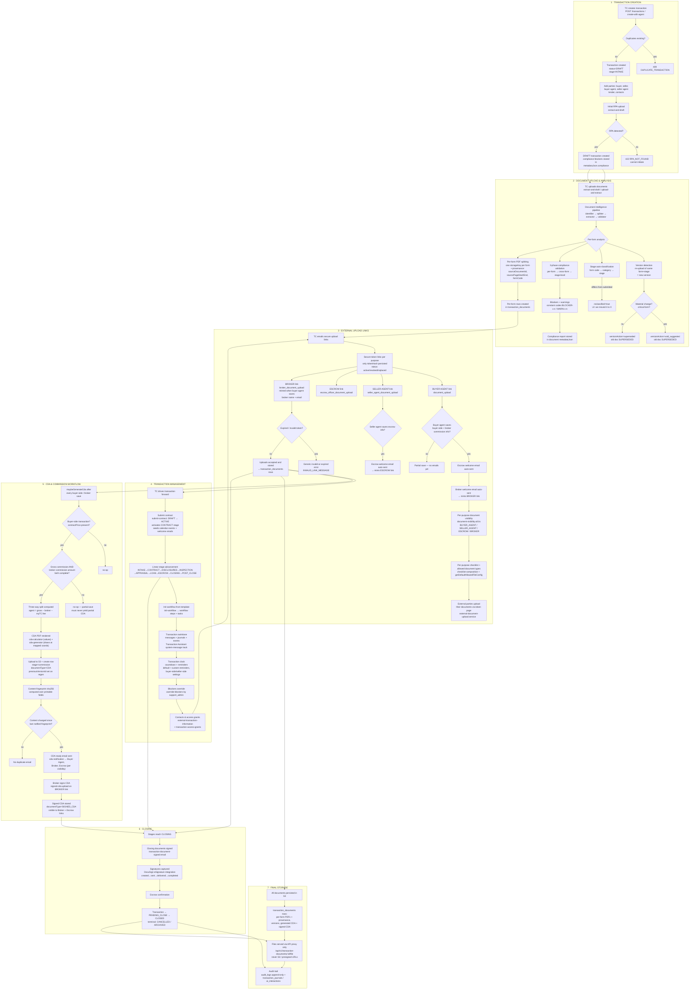

# myTC Application — Complete Workflow Flowchart

The complete lifecycle of a real-estate transaction through the myTC platform,
from creation to final storage. Rendered as a Mermaid `flowchart TD`
(GitHub renders this natively), with an ASCII fallback and a stage-by-stage
breakdown below.

## Participants

| Participant | In the system as |
|---|---|
| Transaction Coordinator (TC) | `users` with `TRANSACTION_COORDINATOR` role; owns the transaction via the dashboard |
| Buyer Agent | external — invited via `BUYER_AGENT_TRANSACTION_DOCUMENT_UPLOAD` upload link |
| Seller Agent | external — invited via `SELLER_AGENT_TRANSACTION_DOCUMENT_UPLOAD` upload link |
| Broker | external — invited via `BROKER_TRANSACTION_DOCUMENT_UPLOAD` upload link (minted when the Buyer Agent saves broker commission info) |
| Escrow | external — invited via `ESCROW_OFFICER_TRANSACTION_DOCUMENT_UPLOAD` upload link (minted when the Seller Agent saves escrow info) |
| Lender / Buyer / Seller | captured as transaction parties (`transaction_parties`) |
| Document Intelligence | `@tc/document-intelligence` package (extractor, identifier, splitter, validator, reasoner, comparison, pipeline) |
| Upload Links | `upload-links` module — token-scoped secure pages, per-purpose checklists + visibility |
| Transaction Swimlane | `transaction-messages` / `transaction-journals` / `transaction-events` timeline shown in the dashboard |
| CDA Generator | `cda` + `cda-notification` modules → `@tc/document-intelligence` CDA PDF renderer |
| Email Notifications | `upload-link-email.service` + Mailgun; Handlebars templates in `apps/api/views/emails/` |
| Final Storage | S3 via `storage` module; files served through the API proxy |

## Mermaid Flowchart



## ASCII Fallback

```
[TC creates transaction] → {duplicate?} → 409 | [DRAFT, INTAKE]
        → [add parties] → [initial RPA upload] → {RPA?} → 422 | [DRAFT created]
1 → 2  → [doc upload + analysis]
            ├→ version detection → {material change? critical?} → void_suggested / superseded
            ├→ stage auto-classification → reclassified flag
            ├→ 3-phase compliance → blockers/warnings catalog
            └→ per-form PDF split → one storageKey/form + provenance
2 → 3  → [external upload links]
            ├ buyer_agent link → {buyer-side+broker info saved?} → escrow email → broker email → BROKER link
            ├ seller_agent link → {escrow info saved?} → escrow email → ESCROW link
            ├ escrow_officer link
            ├ broker_document_upload link → {expired/invalid?} → generic error
            └ per-purpose visibility + checklist → uploads stored
3 → 4  → [transaction management]
            submit-contract (DRAFT→ACTIVE) → stage advancement (9 linear stages)
            → workflow init → swimlane + TA track → clock/reminders → blocker override
4 → 5  → [CDA & commission]
            {buyer-side? price?} → {gross + broker commission complete?}
            → 3-way split → render CDA → S3 + row (versioned)
            → fingerprint {changed?} → CDA-ready emails → broker signs → signed CDA stored
5/4 → 6 → [closing]
            CLOSING stage → DocuSign signatures → escrow confirm → PENDING_CLOSE → CLOSED
6 → 7  → [final storage]
            S3 + transaction_documents + API-proxy view + append-only audit trail
```

## Table version

| Step | Stage | Who | Action | Result / Output |
|---|---|---|---|---|
| 1 | 1 · Creation | TC | Create transaction (`POST /transactions` / `create-with-agent`) | Transaction row created; DRAFT status; INTAKE stage |
| 2 | 1 · Creation | System | Duplicate check (org + address) | Duplicate → 409 DUPLICATE_TRANSACTION, no draft |
| 3 | 1 · Creation | TC | Add parties (buyer, seller, buyer agent, seller agent, lender, contacts) | `transaction_parties` rows; invitations sent |
| 4 | 1 · Creation | TC | Initial RPA upload (`extract-and-draft`) | RPA gate: none detected → 422 RPA_NOT_FOUND |
| 5 | 1 · Creation | Document Intelligence | Extract RPA + compliance validation | DRAFT persists; blockers stored in `metadataJson.compliance` |
| 6 | 2 · Upload & Analysis | TC | Upload more documents (`upload-and-extract`) | Per-form extraction + analysis (no RPA gate) |
| 7 | 2 · Upload & Analysis | Document Intelligence | Run pipeline (identifier → splitter → extractor → validator) | Detected form code, extracted data, per-form PDFs |
| 8 | 2 · Upload & Analysis | System | Version detection (same form + stage re-upload) | New version; old doc SUPERSEDED; `versionNo` incremented |
| 9 | 2 · Upload & Analysis | System | Material change check (critical form + comparison) | `void_suggested` vs `superseded`; comparison in metadataJson |
| 10 | 2 · Upload & Analysis | System | Stage auto-classification (form code → category → stage) | Mismatch → `reclassified: true`, doc moved |
| 11 | 2 · Upload & Analysis | System | 3-phase compliance validation (per-form → cross-form → stage-level) | Blockers + warnings (`BLOCKER-x-n` / `WARN-x-n`) |
| 12 | 2 · Upload & Analysis | System | Per-form PDF splitting + provenance | One `storageKey` per form; `sourceDocumentId`, `sourcePageStart/End`, `formCode` |
| 13 | 3 · Upload Links | TC | Email secure upload links to external parties | Token links minted (only tokenHash persisted; active/revoked/replaced) |
| 14 | 3 · Upload Links | Buyer Agent | Save buyer-side + broker commission info on token page | Escrow welcome email auto-sent |
| 15 | 3 · Upload Links | Broker | Broker link minted + welcome email (from buyer-agent save) | `broker_document_upload` link created |
| 16 | 3 · Upload Links | Seller Agent | Save escrow info on token page | Escrow welcome email → `escrow_officer_document_upload` link minted |
| 17 | 3 · Upload Links | External parties | Upload documents via token-scoped page | Per-purpose checklist + allowed file config enforced |
| 18 | 3 · Upload Links | System | Token validation | Invalid/expired → generic INVALID_LINK_MESSAGE |
| 19 | 3 · Upload Links | System | Per-purpose document visibility | `document-visibility.util.ts` BUYER_AGENT / SELLER_AGENT / ESCROW / BROKER |
| 20 | 4 · Management | TC | Submit contract (`submit-contract`) | DRAFT → ACTIVE; CONTRACT stage; calendar events + welcome emails |
| 21 | 4 · Management | TC | Advance stages manually (9 linear stages) | INTAKE → … → POST_CLOSE |
| 22 | 4 · Management | System | Init workflow from template (`init-workflow`) | Workflow steps + tasks seeded |
| 23 | 4 · Management | TC / Assistant | Transaction swimlane (messages + journals + events) | Human conversation + Transaction Assistant system track |
| 24 | 4 · Management | System | Transaction clock + reminders | Countdown; default + custom reminders (buyer/seller-side settings) |
| 25 | 4 · Management | support_admin | Override blockers | `override-blockers`; unblocks stage advancement |
| 26 | 5 · CDA & Commission | System | `maybeGenerateCda` after buyer-side/broker saves | Gate: buyer-side + contractPrice present? |
| 27 | 5 · CDA & Commission | System | Wait for commission completeness | No-op until `grossCommission` AND `brokerCommissionAmount` set |
| 28 | 5 · CDA & Commission | System | Compute three-way split | agent = gross − broker − myTC fee |
| 29 | 5 · CDA & Commission | CDA Generator | Render 1-page CDA PDF | `cda-calculator` values → `cda-generator` draws at mapped coords |
| 30 | 5 · CDA & Commission | System | Store CDA (S3 + row) | stage=commission, `CDA_DOCUMENT_TYPE`, `previousVersionId` on regen |
| 31 | 5 · CDA & Commission | System | Content fingerprint (sha256) comparison | Change → email; identical → no duplicate email |
| 32 | 5 · CDA & Commission | System | CDA-ready emails (cda-notification) | Sent to Buyer Agent, Broker, Escrow per visibility |
| 33 | 5 · CDA & Commission | Broker | Sign + upload CDA via broker link | `SIGNED_CDA_DOCUMENT_TYPE` stored; visible to Broker + Escrow |
| 34 | 6 · Closing | System | Stages reach CLOSING | Signed documents tracked; `transaction-document-signed` emails |
| 35 | 6 · Closing | DocuSign / parties | eSignature envelopes | created → sent → delivered → completed |
| 36 | 6 · Closing | Escrow | Escrow confirmation | Status → PENDING_CLOSE |
| 37 | 6 · Closing | System | Close transaction | Status → CLOSED (terminal: CANCELLED / ARCHIVED) |
| 38 | 7 · Final Storage | System | All docs persisted in S3 | Per-form PDFs + versions + generated/signed CDA |
| 39 | 7 · Final Storage | System | Serve files via API proxy only | `/api/v1/transaction-documents/:id/file` (never S3/presigned) |
| 40 | 7 · Final Storage | System | Append-only audit trail | `audit_logs`, `transaction_journals`, `ai_interactions` |

## Key decision points

| # | Decision | Gate | Outcome |
|---|---|---|---|
| D1 | Duplicate transaction? | org + address match | 409, no draft created |
| D2 | RPA in first upload? | `isRpaDocument()` | 422 blocks initiation; subsequent uploads have no RPA gate |
| D3 | Material change on re-upload? | critical form + `isMaterialChange()` | `void_suggested` vs `superseded` |
| D4 | Uploaded to wrong stage? | form code → category → stage | `reclassified: true`, doc moved |
| D5 | Buyer-side + broker data complete? | `grossCommission` + `brokerCommissionAmount` | CDA generated; otherwise no-op |
| D6 | CDA content changed? | sha256 content fingerprint | CDA-ready emails re-sent only on real change |
| D7 | Link purpose / expiry | purpose + tokenHash + expiresAt | per-purpose checklist, visibility, INVALID_LINK_MESSAGE |

## Stage notes

- **Creation** — `POST /transactions` / `POST /transactions/create-with-agent` create the
  DRAFT (INTAKE) transaction. The RPA gate (`extract-and-draft`) is the only hard
  enforcement at upload; validation is diagnostic and stored in
  `metadataJson.compliance`.
- **Document analysis** — the `document-extraction` module drives the
  `@tc/document-intelligence` pipeline (identifier → splitter → extractor → validator).
  `upload-and-extract` versions documents, computes comparison results, and splits
  multi-form PDFs into per-form rows with provenance (`sourceDocumentId`,
  `sourcePageStart/End`, `formCode`).
- **Upload links** — one secure token-scoped page per recipient. The buyer-agent page
  doubles as the commission-capture surface ("Buyer Broker Commission Information",
  `apps/web/src/app/upload-links/[token]/page.tsx:846-849`). Saving broker name/email
  there mints the Broker link; saving escrow info mints the Escrow link. All welcome
  emails are non-fatal (`try/catch`), and sends are fingerprint-deduped.
- **Management** — `submit-contract` advances DRAFT → ACTIVE and seeds the swimlane,
  calendar events, and welcome emails. Stages advance manually; workflow
  steps/tasks come from `init-workflow` templates. The swimlane shows both human
  conversation and the Transaction Assistant system-message track.
- **CDA & commission** — buyer-side only. `CdaGenerationService.maybeGenerateCda`
  fires after each save, waits until both commission sections are complete, computes
  the three-way split (agent = gross − broker − myTC fee), renders the 1-page PDF from
  `CDA_FIELD_MAPPINGS` coordinates, stores it as a versioned document
  (`documentType=CDA`, stage `commission`), and — only when the content fingerprint
  changed — emails Buyer Agent, Broker, and Escrow. The Broker then uploads the signed
  CDA (`signed-cda-upload`, `SIGNED_CDA_DOCUMENT_TYPE`), visible to Broker + Escrow.
- **Closing** — DocuSign envelopes for signing; `transaction-document-signed` emails;
  escrow confirmation; status to PENDING_CLOSE then CLOSED (terminal CANCELLED/ARCHIVED).
- **Final storage** — all bytes live in S3 (`storage` module); the app only ever serves
  them through the API proxy `/api/v1/transaction-documents/:id/file` (never presigned
  URLs, `docs/design.md:614`). Append-only audit: `audit_logs`, `transaction_journals`,
  `ai_interactions`.

## Source of truth

- `apps/api/src/modules/transactions/transactions.controller.ts` — creation, submit-contract, stages, status
- `apps/api/src/modules/document-extraction/document-extraction.controller.ts` — extract-and-draft, upload-and-extract, RPA gate, reclassification
- `apps/api/src/modules/upload-links/upload-link.controller.ts:225-255` — welcome-email auto-triggers + `maybeGenerateCda`
- `apps/api/src/modules/upload-links/upload-link.types.ts` — the four purposes (incl. `BROKER_TRANSACTION_DOCUMENT_UPLOAD = 'broker_document_upload'`)
- `apps/api/src/modules/upload-links/document-visibility.util.ts` — per-purpose document visibility
- `apps/api/src/modules/upload-links/external-document-upload.service.ts` — external uploads, broker path
- `apps/api/src/modules/cda/cda-generation.service.ts` — CDA generation gate + three-way split
- `apps/api/src/modules/cda-notification/cda-notification.service.ts` — CDA-ready emails
- `apps/api/src/modules/signed-cda-upload/signed-cda-upload.service.ts` — Broker signed-CDA upload
- `apps/api/src/modules/broker-onboarding/broker-onboarding.service.ts` — broker link minting + welcome email
- `apps/api/src/modules/escrow-onboarding/` — escrow welcome email
- `apps/api/src/modules/transaction-workspace/transaction-workspace.service.ts` — workspace composition incl. per-purpose checklists
- `packages/document-intelligence/src/cda/` — `cda-calculator.ts`, `cda-generator.ts`, `config/cda-field-mappings.ts`
- `docs/design.md:614` — storage served through API proxy only
